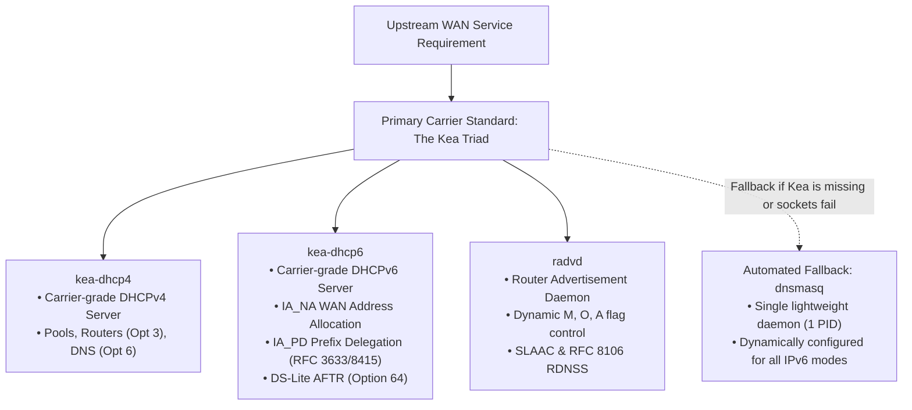

# DHCP & Network Namespace Isolation

This document explains the nuances of running DHCP clients and servers inside Linux network namespaces, preventing host filesystem contamination, and managing device identity signaling.

---

## 1. DHCP Client Nuances in Namespaces

### 1.1. `udhcpc` and Custom Event Script
Unlike desktop DHCP clients, `udhcpc` (from BusyBox) does not modify network interfaces directly; it delegates interface configuration to a shell script specified via `-s <script>`.

#### The Trap: Host `/etc/resolv.conf` Overwrite
The system default script (`/usr/share/udhcpc/default.script` or `/etc/udhcpc/default.script`) typically updates `/etc/resolv.conf`. Because `/etc/resolv.conf` is shared across all namespaces on the host, a test client inside a namespace will overwrite host DNS settings!

#### The Anti-Pattern: `-s /bin/true`
To prevent overwriting DNS, engineers often run:
```bash
udhcpc -i eth0 -s /bin/true  # WRONG!
```
This prevents `/etc/resolv.conf` corruption, but `/bin/true` also ignores the `bound` event, meaning **the interface never receives the acquired IP or default gateway**.

#### The Production Solution: `scripts/lib/udhcpc.script`
The framework supplies a namespace-safe event script that configures IP and routes locally without touching host files:

```bash
#!/bin/sh
set -eu

case "${1:-}" in
    bound|renew)
        ip -4 addr flush dev "${interface}" 2>/dev/null || true
        ip -4 addr add "${ip}/${prefix:-24}" dev "${interface}" 2>/dev/null || true
        if [ -n "${router:-}" ]; then
            ip -4 route add default via "${router%% *}" dev "${interface}" 2>/dev/null || true
        fi
        ;;
    deconfig)
        ip -4 addr flush dev "${interface}" 2>/dev/null || true
        ;;
esac
```

---

### 1.2. `dhclient` Lease Database Collision
By default, ISC `dhclient` stores its state in `/var/lib/dhcp/dhclient.leases`.
When running multiple namespaces simultaneously (e.g. `ns-lan1`, `ns-lan2`), they share the same host file. If interfaces share identical names (e.g. `eth0`), `dhclient` attempts to reuse cached leases (Option 50 Requested-IP), causing address allocation collisions and unexpected NAK responses.

#### The Solution: Namespace-Isolated Leases
Always isolate lease database and PID files per namespace:

```bash
dhclient -4 -v -1 \
    -lf "${STATE_DIR}/dhclient-${NS_NAME}.leases" \
    -pf "${STATE_DIR}/dhclient-${NS_NAME}.pid" \
    "${IFACE}"
```

---

## 2. Device Identity Signaling: Hostname (Opt 12) & Vendor ID (Opt 60)

When testing CPE routers, carrier gateway Web GUIs categorize connected clients by device name (e.g. `Living-Room-STB`, `Smart-TV`) and vendor class.

Standard RFC 2132 options:
- **DHCP Option 12 (Host Name)**: Advertises device hostname.
- **DHCP Option 60 (Vendor Class Identifier)**: Identifies hardware/device profile.

### Production Invocation:
```bash
ip netns exec "${ns}" udhcpc \
    -i "${ns_if}" \
    -n -q -t 5 -T 2 \
    -s "${PROJECT_ROOT}/scripts/lib/udhcpc.script" \
    -p "${STATE_DIR}/udhcpc-${ns}.pid" \
    -x "hostname:${hostname}" -F "${hostname}" \
    -V "${vendor_id:-Carrier_STB_v2}"
```

---

## 3. Standardized Upstream WAN Server Architecture: The Kea Triad Standard

Commercial CPE routers, home gateways, and carrier devices under test (DUT) require complete upstream WAN services to acquire public/WAN IP addressing, default routes, DNS resolvers, and delegated IPv6 prefixes.

The framework mandates **Concurrent Dual-Stack (DHCPv4 + DHCPv6)** as the default WAN architecture (`IP_VERSION="dual"`), powered by the **Kea Triad (`kea-dhcp4` + `kea-dhcp6` + `radvd`)** as the **Primary Standard Architecture**, while maintaining **`dnsmasq` as an automated lightweight fallback**.



---

### 3.1. Supported WAN DHCPv6 & IPv6 Operational Modes

The framework supports 7 standard IPv6 WAN deployment modes via `WAN_IPV6_MODE` in `config.env`:

| Mode (`WAN_IPV6_MODE`) | Standard RFCs | `AdvManagedFlag` (M) | `AdvOtherConfigFlag` (O) | `AdvAutonomous` (A) | Daemons Active | Description |
| :--- | :--- | :---: | :---: | :---: | :--- | :--- |
| `dual-stack` *(Default)* | RFC 8415, RFC 3633, RFC 4861 | **on** | **on** | **on** | `kea-dhcp4` + `kea-dhcp6` + `radvd` | Full concurrent dual-stack: DHCPv4 + Stateful DHCPv6 (IA_NA + IA_PD) + SLAAC fallback. |
| `slaac` | RFC 4862, RFC 8106 | **off** | **off** | **on** | `kea-dhcp4` + `radvd` | Pure Stateless Autoconfiguration: Host generates address from RA prefix; DNS via RDNSS; no DHCPv6 daemon. |
| `stateless` | RFC 8415, RFC 4861, RFC 4862 | **off** | **on** | **on** | `kea-dhcp4` + `kea-dhcp6` + `radvd` | SLAAC address autoconfiguration + DHCPv6 Information-Request for DNS/NTP/AFTR options. |
| `stateful` | RFC 8415 | **on** | **on** | **off** | `kea-dhcp4` + `kea-dhcp6` + `radvd` | Stateful address allocation only via DHCPv6 IA_NA address pool; SLAAC address formation disabled. |
| `stateful-pd` | RFC 3633, RFC 8415 | **on** | **on** | **off** | `kea-dhcp4` + `kea-dhcp6` + `radvd` | Stateful WAN IPv6 address (IA_NA) + Prefix Delegation pool (IA_PD) for downstream LAN router carving. |
| `pd-only` | RFC 3633, RFC 8415 | **off** | **on** | **on** | `kea-dhcp4` + `kea-dhcp6` + `radvd` | SLAAC on WAN interface + DHCPv6 Prefix Delegation (IA_PD) for CPE router downstream subnets. |
| `ds-lite` | RFC 6333, RFC 8415 | **on** | **on** | **off** | `kea-dhcp6` + `radvd` | IPv6-only transport carrying IPv4-in-IPv6 tunnels; signals AFTR FQDN via DHCPv6 Option 64. |

---

### 3.2. Why the Kea Triad is Mandated for Router & Gateway Testing

1. **DHCPv6 Prefix Delegation (IA_PD - RFC 3633 / RFC 8415)**:
   - A CPE router requires an upstream delegated prefix (e.g. `/56` or `/60`) on its WAN port, which it then carves into `/64` subnets to advertise to downstream LAN clients, IPTV set-top boxes, and Wi-Fi networks.
   - `dnsmasq` **cannot act as an IA_PD Prefix Delegating Server**. It only supports consuming prefixes already delegated to its physical interface via `constructor:`, not carving and managing dynamic delegated pools for requesting routers.
   - `kea-dhcp6` natively provides carrier-grade `pd-pools` configuration (`prefix`, `prefix-len`, `delegated-len`) for standard RFC 3633 / RFC 8415 conformance.
2. **Deterministic Dual-Stack Isolation**:
   - `kea-dhcp4` handles IPv4 leasing independently from IPv6, avoiding lease file race conditions and cross-family lockups.
3. **Autonomous Router Advertisements (`radvd`)**:
   - `radvd` provides explicit, fine-grained control over RFC 4861 / RFC 8106 flags (`AdvManagedFlag`, `AdvOtherConfigFlag`, `AdvAutonomous`) and fast convergence intervals (`MinRtrAdvInterval 3s`, `MaxRtrAdvInterval 10s`), triggering DUT DHCPv6 requests without delay.

---

### 3.2. Configuration Templates

Standard templates are stored in `config/kea/` and `config/radvd/` and dynamically rendered into `${STATE_DIR}/` at runtime via `render_wan_template`:

#### 1. Kea DHCPv4 Template (`config/kea/kea-dhcp4.conf.in`)
```json
{
  "Dhcp4": {
    "interfaces-config": {
      "interfaces": [ "@DUT_IF@" ],
      "service-sockets-max-retries": 5,
      "service-sockets-retry-wait-time": 1000
    },
    "lease-database": {
      "type": "memfile",
      "persist": false
    },
    "valid-lifetime": @DHCP_VALID_LIFETIME_SEC@,
    "renew-timer": @DHCP_RENEW_TIMER_SEC@,
    "rebind-timer": @DHCP_REBIND_TIMER_SEC@,
    "subnet4": [
      {
        "id": 1,
        "subnet": "@WAN_IPV4_SUBNET@",
        "pools": [
          {
            "pool": "@WAN_IPV4_POOL_START@ - @WAN_IPV4_POOL_END@"
          }
        ],
        "option-data": [
          {
            "name": "routers",
            "data": "@WAN_IPV4_ROUTER@"
          },
          {
            "name": "domain-name-servers",
            "data": "@WAN_IPV4_DNS@"
          }
        ]
      }
    ],
    "loggers": [
      {
        "name": "kea-dhcp4",
        "output_options": [
          {
            "output": "stdout"
          }
        ],
        "severity": "INFO",
        "debuglevel": 0
      }
    ]
  }
}
```

#### 2. Kea DHCPv6 Template (`config/kea/kea-dhcp6.conf.in`)
```json
{
  "Dhcp6": {
    "interfaces-config": {
      "interfaces": [ "@DUT_IF@" ],
      "service-sockets-max-retries": 5,
      "service-sockets-retry-wait-time": 1000
    },
    "lease-database": {
      "type": "memfile",
      "persist": false
    },
    "valid-lifetime": @DHCP_VALID_LIFETIME_SEC@,
    "renew-timer": @DHCP_RENEW_TIMER_SEC@,
    "rebind-timer": @DHCP_REBIND_TIMER_SEC@,
    "preferred-lifetime": @DHCP6_PREFERRED_LIFETIME_SEC@,
    "subnet6": [
      {
        "id": 1,
        "subnet": "@WAN_IPV6_PREFIX@",
        "interface": "@DUT_IF@",
        "rapid-commit": true,

        // 1. Allocate IPv6 address to DUT WAN interface (IA_NA - RFC 8415)
        "pools": [
          {
            "pool": "@WAN_IPV6_POOL_START@ - @WAN_IPV6_POOL_END@"
          }
        ],

        // 2. Delegate IPv6 Prefix pool for DUT LAN subnets (IA_PD - RFC 3633 / RFC 8415)
        // Slices /56 pool into /60 blocks per requesting CPE router
        "pd-pools": [
          {
            "prefix": "@PD_PREFIX@",
            "prefix-len": @PD_PREFIX_LEN@,
            "delegated-len": @PD_DELEGATED_LEN@
          }
        ],

        "option-data": [
          {
            "name": "dns-servers",
            "data": "@WAN_IPV6_DNS@"
          },
          {
            "name": "domain-search",
            "data": "example.com"
          },
          {
            "name": "aftr-name",
            "data": "@AFTR_NAME@"
          }
        ]
      }
    ],
    // 3. Logger configured to stdout to prevent Kea 3.0 path sandbox restrictions
    "loggers": [
      {
        "name": "kea-dhcp6",
        "output_options": [
          {
            "output": "stdout"
          }
        ],
        "severity": "INFO",
        "debuglevel": 0
      },
      {
        "name": "kea-dhcp6.leases",
        "output_options": [
          {
            "output": "stdout"
          }
        ],
        "severity": "DEBUG",
        "debuglevel": 50
      }
    ]
  }
}
```

#### 3. Router Advertisement Daemon Template (`config/radvd/radvd.conf.in`)
```conf
interface @DUT_IF@
{
    AdvSendAdvert on;
    AdvDefaultLifetime @RA_LIFETIME_SEC@;
    MinRtrAdvInterval @RA_MIN_INTERVAL_SEC@;
    MaxRtrAdvInterval @RA_MAX_INTERVAL_SEC@;
    AdvManagedFlag @RA_MANAGED_FLAG@;
    AdvOtherConfigFlag @RA_OTHER_CONFIG_FLAG@;

    prefix @WAN_IPV6_PREFIX@
    {
        AdvOnLink on;
        AdvAutonomous @RA_AUTONOMOUS_FLAG@;
    };

    RDNSS @WAN_IPV6_RDNSS@
    {
        AdvRDNSSLifetime @RA_LIFETIME_SEC@;
    };
};
```

---

### 3.3. Mandatory Production Safeguards for Kea & radvd

Deploying the Kea triad inside network namespaces requires specific safeguards to prevent runtime failures:

1. **The Kea 3.0+ Log Path Sandbox Trap**:
   - In Kea 3.0+, configuring `"output": "/var/log/kea-dhcp6.log"` or any path outside `/var/log/kea/` causes Kea to reject the configuration with `COMMAND_PROCESS_ERROR2: invalid path in output, supported path is '/var/log/kea'`.
   - **Rule**: Always configure `"output": "stdout"` in Kea json configs. The launcher script redirects standard output directly to `${LOG_DIR}/kea-dhcp4.log` and `${LOG_DIR}/kea-dhcp6.log`.
2. **Host AppArmor Profile Lock Trap**:
   - Host packages install AppArmor profiles (`/etc/apparmor.d/usr.sbin.kea-dhcp*`) that deny write access to test directory paths (`EACCES`).
   - `prepare_kea_runtime()` automatically unloads these profiles:
     ```bash
     if command -v apparmor_parser >/dev/null 2>&1; then
         apparmor_parser -R /etc/apparmor.d/usr.sbin.kea-dhcp4 2>/dev/null || true
         apparmor_parser -R /etc/apparmor.d/usr.sbin.kea-dhcp6 2>/dev/null || true
     fi
     install -d -m 0777 /run/kea /run/lock/kea "${STATE_DIR}/kea"
     ```
3. **Netns Socket Readiness Trap (`DHCPSRV_NO_SOCKETS_OPEN`)**:
   - Kea binds directly to raw sockets on the WAN interface. If `eth0` in `ns-wan` has not completed DAD or lacks a link-local address, Kea aborts immediately.
   - `wan_dhcp_server()` ensures a valid link-local address and IPv6 forwarding are active before Kea launches:
     ```bash
     ip -n "${wan_ns}" -6 addr add "fe80::254/64" dev "${wan_if}" nodad 2>/dev/null || true
     ip netns exec "${wan_ns}" sysctl -q -w net.ipv6.conf.all.forwarding=1 2>/dev/null || true
     ```
4. **Automated Fallback to `dnsmasq`**:
   - If `kea-dhcp6` fails to bind sockets or `kea` binaries are absent on the system, `wan_dhcp_server()` automatically detects the failure and brings up `dnsmasq` as a fallback daemon.

---

### 3.4. Secondary Fallback Standard: `dnsmasq` Profiles

For minimal host-only labs (where no prefix delegation is required) or environments without Kea installed, `dnsmasq` provides a lightweight fallback:

##### Profile A: IPv4-Only (`ipv4-only`)
```conf
port=0
no-resolv
no-hosts
bind-interfaces
interface=eth0
dhcp-range=10.10.0.100,10.10.0.200,255.255.255.0,12h
dhcp-option=option:router,10.10.0.1
dhcp-option=option:dns-server,10.10.0.1,10.10.0.2
dhcp-authoritative
dhcp-leasefile=state/dnsmasq-wan.leases
log-facility=logs/dnsmasq-wan.log
log-dhcp
```

##### Profile B: Stateless SLAAC + RDNSS (`slaac` - RFC 4862, RFC 8106)
```conf
port=0
no-resolv
no-hosts
bind-interfaces
interface=eth0
enable-ra
dhcp-range=2001:db8:10::1000,2001:db8:10::1fff,slaac,64,12h
dhcp-option=option6:dns-server,[2001:db8:10::1],[2001:db8:10::2]
dhcp-authoritative
dhcp-leasefile=state/dnsmasq-wan.leases
log-facility=logs/dnsmasq-wan.log
log-dhcp
```

##### Profile C: Stateful DHCPv6 (`stateful-v6` - RFC 8415 IA_NA)
```conf
port=0
no-resolv
no-hosts
bind-interfaces
interface=eth0
enable-ra
dhcp-range=2001:db8:10::1000,2001:db8:10::1fff,64,12h
dhcp-option=option6:dns-server,[2001:db8:10::1],[2001:db8:10::2]
dhcp-authoritative
dhcp-leasefile=state/dnsmasq-wan.leases
log-facility=logs/dnsmasq-wan.log
log-dhcp
```

##### Profile D: Stateless DHCPv6 (`stateless-v6` - SLAAC + Info-Request)
```conf
port=0
no-resolv
no-hosts
bind-interfaces
interface=eth0
enable-ra
dhcp-range=2001:db8:10::,ra-stateless,64,12h
dhcp-option=option6:dns-server,[2001:db8:10::1],[2001:db8:10::2]
dhcp-authoritative
dhcp-leasefile=state/dnsmasq-wan.leases
log-facility=logs/dnsmasq-wan.log
log-dhcp
```

##### Profile E: Concurrent Dual-Stack (`dual-stack`)
```conf
port=0
no-resolv
no-hosts
bind-interfaces
interface=eth0
# IPv4 DHCP
dhcp-range=10.10.0.100,10.10.0.200,255.255.255.0,12h
dhcp-option=option:router,10.10.0.1
dhcp-option=option:dns-server,10.10.0.1,10.10.0.2
# IPv6 SLAAC & Stateful DHCPv6
enable-ra
dhcp-range=2001:db8:10::1000,2001:db8:10::1fff,slaac,ra-stateless,64,12h
dhcp-range=2001:db8:10::1000,2001:db8:10::1fff,64,12h
dhcp-option=option6:dns-server,[2001:db8:10::1],[2001:db8:10::2]
dhcp-authoritative
dhcp-leasefile=state/dnsmasq-wan.leases
log-facility=logs/dnsmasq-wan.log
log-dhcp
```

##### Profile F: Dual-Stack Lite (DS-Lite) with AFTR Option 64 (RFC 6333)
```conf
port=0
no-resolv
no-hosts
bind-interfaces
interface=eth0
enable-ra
dhcp-range=2001:db8:10::1000,2001:db8:10::1fff,64,12h
dhcp-option=option6:dns-server,[2001:db8:10::1],[2001:db8:10::2]
# RFC 6333 DHCPv6 Option 64 (AFTR FQDN)
dhcp-option=option6:64,aftr.example.com
dhcp-authoritative
dhcp-leasefile=state/dnsmasq-wan.leases
log-facility=logs/dnsmasq-wan.log
log-dhcp
```

---

## 4. Centralized Domain Architecture: `wan_server.sh` and `client_dhcp.sh`

In mature network test labs, DHCP and service configuration logic should **not** bloat `common.sh`. Instead, adopt the **Centralized Domain Architecture** (Option C):

```
scripts/
├── setup.sh                 # Orchestrator (calls wan_server.sh & client_dhcp.sh)
├── cleanup.sh               # Teardown orchestrator
├── wan_server.sh            # Dedicated WAN server manager (Kea / dnsmasq / radvd)
├── client_dhcp.sh           # Dedicated LAN client manager (udhcpc / dhclient)
└── lib/
    ├── common.sh            # Slim helper library (OS/netns primitives)
    └── logger.sh            # Logging helpers
```

### 4.1. Core Architectural Separation

| Script / Module | Responsibility | CLI Commands | Key Functions |
|---|---|---|---|
| `scripts/lib/common.sh` | Core netns and link primitives (~500 lines) | Sourced only | `create_netns()`, `create_veth()`, `setup_bridge()`, `cleanup_pids()`, `wan_dhcp_server()` (forwarder) |
| `scripts/wan_server.sh` | WAN service lifecycle, template rendering, and daemon fallback | `start [auto\|kea\|dnsmasq]`, `stop`, `status` | `render_wan_template()`, `prepare_kea_runtime()`, `start_kea()`, `start_dnsmasq()` |
| `scripts/client_dhcp.sh` | LAN client DHCP lifecycle, option negotiation, and static fallback | `renew [target]`, `release [target]`, `status` | `dhcp_renew_target()`, `dhcp_release_target()`, client daemon detection (`udhcpc`/`dhclient`) |

### 4.2. Key Benefits

1. **Separation of Concerns & Maintainability**:
   - `common.sh` remains clean, portable, and free of application-specific template rendering or daemon-specific quirk handling.
   - All DHCP server logic (Kea 3.0 path sandbox overrides, AppArmor profile unloading, socket readiness delays, dnsmasq fallback profiles) is localized entirely in `wan_server.sh`.
2. **Interactive CLI & Automated Orchestration**:
   - Operators can run `./scripts/wan_server.sh status` or `./scripts/client_dhcp.sh renew lan1` directly from the terminal without re-running `setup.sh`.
   - `setup.sh` and `cleanup.sh` simply invoke `./scripts/wan_server.sh` and `./scripts/client_dhcp.sh` cleanly via CLI flags (`--wan-dhcp`, `--lan-dhcp`).
3. **Graceful Non-Root Degradation**:
   - Both CLI tools support `-h` and `status` when run without root privileges, safely querying namespaces and pidfiles without failing unexpectedly.
4. **Backward Compatibility**:
   - `common.sh` retains a lightweight delegation wrapper `wan_dhcp_server()` forwarding arguments directly to `"${PROJECT_ROOT}/scripts/wan_server.sh start"`, ensuring zero disruption for legacy scripts.

### 4.3. End-to-End Dual-Stack Lifecycle in Physical Hardware Mode (`--single`)

In physical gateway benchmarking (`--single`), the lab operates as a complete carrier edge and multi-client ecosystem:

```
[Upstream WAN Server]                  [Physical Gateway DUT]                  [Downstream LAN Endpoints]
    (ns-wan)                                (Hardware)                             (ns-pc, ns-stb, ...)
        |                                       |                                           |
        |--- 1. DHCPv4 Offer (203.0.113.x) ---->|                                           |
        |--- 2. DHCPv6 IA_NA + IA_PD (/60) ---->|                                           |
        |--- 3. Router Advertisement (RA) ----->|                                           |
        |                                       |                                           |
        |                           (DUT WAN Online: eth1.1)                                |
        |                           (Activates LAN DHCP & RA)                               |
        |                                       |                                           |
        |                                       |<--- 4. DHCPv4 Discover (udhcpc) ----------|
        |                                       |---- 5. DHCPv4 Ack (192.168.1.x) --------->|
        |                                       |<--- 6. Router Solicitation (RS) ----------|
        |                                       |---- 7. Router Advert + SLAAC (from PD) -->|
```

1. **Upstream Provisioning**: `wan_server.sh` activates `kea-dhcp4`, `kea-dhcp6`, and `radvd` on `ns-wan:eth0`.
2. **DUT WAN Activation**: DUT WAN (`eth1.1`) acquires its public IPv4 (`203.0.113.x`), WAN IPv6 (`2001:db8:10::x`), and delegated `/60` LAN prefix via DHCPv6-PD (`IA_PD`).
3. **DUT LAN Services**: DUT activates internal DHCPv4 server and IPv6 Router Advertisement (`radvd`/`dnsmasq`) on LAN bridge `br0`.
4. **LAN Client Dynamic Acquisition**: In `--single` mode, `LAN_DHCP_CLIENT="1"` is active by default. `client_dhcp.sh renew all` runs inside client namespaces (`ns-pc`), automatically leasing private IPv4 addresses and acquiring global IPv6 SLAAC addresses carved from the delegated prefix.


