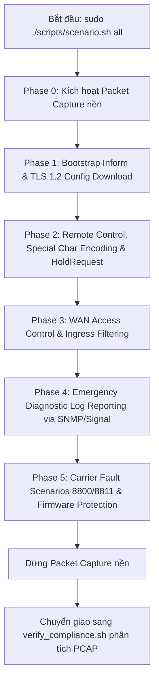
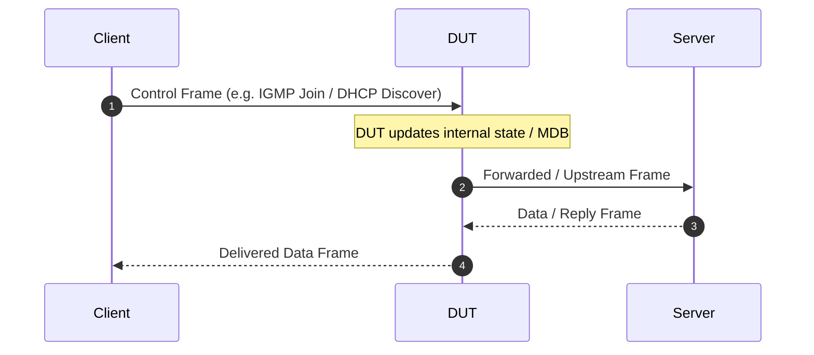

# Khung Thiết Kế Chuẩn Cho Dự Án Network Test Lab Trên Linux

Tài liệu này định nghĩa cấu trúc, nguyên tắc thiết kế, quy ước lập trình và các mẫu mã nguồn chuẩn (boilerplate templates) để xây dựng các dự án **Network Test Lab** chạy trên Linux (sử dụng Network Namespaces, veth pairs, Linux Bridge, packet captures, và kịch bản kiểm thử tự động).

---

## 1. Triết Lý & Nguyên Tắc Cốt Lõi

1. **Cô lập luồng mạng (Traffic Isolation)**:
   - Các thực thể mạng (Client, Server giả lập, Attacker, Monitor) phải được tách biệt trong các **Linux Network Namespaces (`netns`)**.
   - Lưu lượng kiểm thử phải đi qua đường truyền dữ liệu thực của **DUT (Device Under Test)**, không được kết nối tắt (bypass) nội bộ trên máy host nếu bài test yêu cầu kiểm tra switch/bridge/routing phần cứng của DUT.
2. **An toàn máy Host & Tự động xử lý cấu hình rác (Host Safety & Smart Unmanage)**:
   - **Không bao giờ** can thiệp hoặc xóa bảng firewall (`iptables`/`nftables`) toàn cục của máy host.
   - **Không bao giờ** ghi đè hoặc làm gián đoạn default route của máy host (tuyệt đối từ chối `lo` và card mạng mang default route).
   - **Tự động xử lý NetworkManager**: Khi cắm card USB-to-Ethernet mới, NetworkManager thường tự cấp IP rác (DHCP/link-local). Thay vì báo lỗi và dừng script, hệ thống tự động gỡ quản lý (`nmcli device set <iface> managed no`) và xóa IP rác (`ip addr flush`) trên card mạng test an toàn.
3. **Tính lặp lại & Tự phục hồi (Idempotency & Auto-Rollback)**:
   - `setup.sh` và `cleanup.sh` phải chạy được nhiều lần liên tiếp mà không gây lỗi tích lũy.
   - Quá trình `setup.sh` phải trang bị **Rollback Trap (`trap ERR`)** để khi gặp lỗi giữa chừng, toàn bộ tài nguyên tạm thời được tự động thu hồi sạch sẽ về trạng thái ban đầu.
4. **Chuẩn hóa Bash Strict Mode & Chống vỡ ống dẫn (SIGPIPE Prevention)**:
   - 100% shell scripts viết bằng **Bash** với `set -Eeuo pipefail` và `IFS=$'\n\t'`.
   - **Khắc phục lỗi SIGPIPE**: Trong `pipefail`, các lệnh như `tshark ... | head -n1` hoặc `... | awk '... exit'` thoát sớm sẽ làm lệnh đầu nhận tín hiệu `SIGPIPE` (mã lỗi 141) khiến cả script bị dừng. Mọi pipeline bắt buộc phải bọc chống lỗi: `(tshark ... 2>/dev/null || true) | head -n1`.
5. **Tách biệt Cấu hình và Mã nguồn (Config-as-Data & Strict Quoting)**:
   - Mọi thông số phần cứng, tên interface, dải IP, timeout, bộ lọc capture, lệnh DUT được lưu trong `config.env`.
   - **Quy tắc trích dẫn nghiêm ngặt**: Tất cả các giá trị chuỗi chứa khoảng trắng, cờ BPF, hoặc dấu phẩy (như `CAPTURE_FILTER="igmp or udp"`, `PEER_SSH_OPTS="-o ..."`) **bắt buộc phải bọc trong dấu ngoặc kép `""`** để tránh lỗi bash subshell (`command not found`).
6. **Linh hoạt Topology (Single-PC, Distributed 2-PC, Virtual Mode)**:
   - Một lab chuẩn phải hỗ trợ linh hoạt 3 mô hình triển khai:
     - **Mode 1: Physical Single-PC (Dual-NIC)** (`LAB_ROLE=single`): 1 PC trang bị 2 card USB Ethernet (`WAN_IF` và `LAN_IF`) cắm vào DUT, kịch bản chạy khép kín cục bộ.
     - **Mode 2: Physical Distributed Two-PC** (`LAB_ROLE=wan`/`lan`): 2 PC độc lập điều phối qua SSH (`PEER_SSH_HOST`).
     - **Mode 3: Virtual / No-DUT Simulation (`--virtual` / `--no-dut`)**: Mô phỏng 100% bằng Linux namespaces (`ns-dut`) và `veth` pairs phục vụ học tập, kiểm thử script và chạy CI/CD không cần phần cứng.
7. **Xác minh dựa trên bằng chứng (Verification by Evidence)**:
   - Mọi kết quả kiểm thử phải được kiểm chứng tự động thông qua file bắt gói tin (`.pcap`/`.pcapng`) bằng script `verify_*.sh`.
   - Bảng phân tích Timeline rõ ràng, đo lường định lượng các chỉ số (độ trễ Join-to-Data $\le 20\text{ms}$, thời gian backoff $\sim 2.0\text{s}$, cách ly IP bị từ chối) và trả về trạng thái `[PASS]` / `[FAIL]` chuẩn xác.
8. **Non-Root Graceful Degradation & Quản lý Quyền An Toàn (0777 Runtime Dirs)**:
   - Các lệnh xem thông tin, hiển thị hướng dẫn (`-h`/`--help`), tiền kiểm chẩn đoán (`diagnose.sh`, `show_state.sh`, `run_smoke.sh`), và phân tích gói tin (`verify_*.sh`) phải chạy mượt mà dưới tài khoản user thường, chỉ yêu cầu sudo khi thực sự thao tác can thiệp network namespace hoặc cấu hình card mạng.
   - Thư mục runtime (`logs/`, `captures/`, `state/`) phải được khởi tạo với quyền `0777` (`chmod -R a+rw`) để loại bỏ triệt để lỗi "Permission Denied" khi làm việc luân phiên giữa tài khoản thường và `sudo`.
9. **Đồng bộ Dịch Vụ Xác Định (Deterministic Synchronization vs. Arbitrary Sleep)**:
   - Tuyệt đối loại bỏ các lệnh `sleep` cảm tính (`sleep 1`, `sleep 2`) để chờ daemon khởi động.
   - Sử dụng các hàm helper polling socket xác định: `wait_for_port <port> <host> <timeout>` hoặc `wait_for_http <url> <expected_code> <timeout>` để kiểm tra socket TCP/UDP thực sự lắng nghe trước khi kích hoạt kịch bản test.
10. **Quản lý Tiến trình Tin cậy & Xử lý PID Stale (Stale PID Detection & Escalating Kill)**:
    - Quản lý daemon qua PID file phải phân biệt được tiến trình thực tế đang chạy với file `.pid` cũ còn sót lại sau khi hệ thống crash (kiểm tra `kill -0` và `/proc/<pid>`).
    - Quy trình dừng daemon leo thang 3 cấp độ: `SIGINT` (cho phép ghi log) $\rightarrow$ `SIGTERM` (dừng lịch sự) $\rightarrow$ `SIGKILL` (cưỡng chế nếu bị treo).
    - Cung cấp hàm `stop_process_by_pattern` để dọn dẹp sạch sẽ các tiến trình mồ côi (orphan background processes).
11. **Tiêu Chuẩn CLI & Xử Lý Trợ Giúp Thân Thiện (Non-Root Help, Exit Code 0 & Zero Traps)**:
    - **100% script** trong dự án bắt buộc phải hỗ trợ cờ `-h` và `--help`.
    - **Không cần root cho trợ giúp**: Người dùng chạy `./scripts/<script>.sh -h` tuyệt đối không bao giờ bị chặn bởi quyền `root`/`sudo`, không bao giờ bị lỗi vì thiếu gói phần mềm chưa cài (`require_cmd`), và không bao giờ bị lỗi vì thiếu file pcap/state.
    - **Mã thoát chuẩn (Strict Exit Code 0)**: Khi người dùng chủ động xem trợ giúp qua `-h` hoặc `--help`, script **bắt buộc luôn trả về exit code 0**. Chỉ trả về exit code khác 0 (như 1 hoặc 2) khi người dùng nhập sai cú pháp hoặc thiếu tùy chọn bắt buộc.
    - **Cấu trúc Usage 6 khối chuẩn**: `Description`, `Usage`, `Options / Arguments`, `Subcommands` (nếu có), `Examples`, và `Suggested Next Steps`.

---

## 2. Cấu Trúc Thư Mục Dự Án Chuẩn

```text
<lab_project_name>/
├── .gitignore                    # Bỏ qua config cục bộ, file logs/pids/pcaps/.venv
├── config.env.example            # Cấu hình mẫu với đầy đủ chú thích (trích dẫn nghiêm ngặt)
├── README.md                     # Tài liệu tổng quan, sơ đồ Mermaid Sequence, bảng IP, lệnh chạy
├── docs/
│   ├── SHELL_STYLE.md            # Quy ước viết code Shell strict mode của dự án
│   ├── TEST_PLAN.md              # Bảng test cases, điều kiện tiên quyết, tiêu chí PASS/FAIL
│   └── TROUBLESHOOTING.md        # Hướng dẫn xử lý sự cố thiết bị DUT & host Linux
├── captures/                     # Thư mục lưu trữ file .pcap / .pcapng
│   └── .gitkeep
├── logs/                         # Thư mục lưu trữ audit log, daemon stdout/stderr
│   └── .gitkeep
├── state/                        # Thư mục runtime: PID files, topology_state.env, last_capture.env
│   └── .gitkeep
├── tools/                        # (Tùy chọn) Script Python Scapy / socket tiêm hoặc nhận gói
│   └── <feature>_tool.py
└── scripts/
    ├── lib/
    │   ├── common.sh             # Thư viện dùng chung (helpers, validations, logging, lifecycle)
    │   └── udhcpc.script         # (Nếu dùng DHCP) Script gán IP an toàn trong netns
    ├── setup.sh                  # Khởi tạo topology (--single | --wan | --lan | --virtual) kèm Next Steps
    ├── cleanup.sh                # Thu hồi tài nguyên Idempotent, dừng daemon, phục hồi NIC & dọn dẹp state
    ├── capture.sh                # Quản lý vòng đời capture (start | stop | status)
    ├── show_state.sh             # Xem nhanh trạng thái netns, interface IP/routes, daemons, capture
    ├── diagnose.sh               # Chẩn đoán an toàn (non-destructive) host NICs, ciphers, ports, certs
    ├── run_smoke.sh              # Runner tiền trạm một chạm kết hợp diagnose.sh và show_state.sh
    ├── dut_collector.sh          # Thu thập snapshot hệ thống của DUT qua SSH (routing, conntrack, firewall)
    ├── start_servers.sh          # Khởi động các daemon giả lập dịch vụ WAN với start_daemon & wait_for_port
    ├── stop_servers.sh           # Dừng sạch sẽ các daemon dịch vụ với stop_pidfile & stop_process_by_pattern
    ├── scenario.sh               # Kịch bản kiểm thử tự động đa pha (Multi-phase automated smoke)
    ├── wan_dhcp_server.sh        # (Tùy chọn) Cấp IP cho cổng WAN của DUT qua dnsmasq
    ├── client_dhcp.sh            # (Tùy chọn) Quản lý cấp/trả IP động cho client LAN qua udhcpc
    ├── verify_*.sh               # Xác minh bằng chứng PCAP tự động, vẽ Timeline ASCII & xuất PASS/FAIL
    └── <feature>_*.sh            # Các script kích hoạt tính năng (ví dụ: client_renew.sh, query_sender.sh)
```

---

## 3. Kiến Trúc Chi Tiết Từng Module

### 3.1. Cấu hình Môi trường (`config.env.example` & `.gitignore`)

#### `.gitignore` chuẩn:
```gitignore
# Local environment configuration
config.env
!config.env.example

# Runtime state and generated artifacts
state/*
!state/.gitkeep
*.pid
*.log
*.remote

# Packet captures
captures/*
!captures/.gitkeep
*.pcap
*.pcapng

# Python Virtualenv & Cache
.venv/
__pycache__/
*.pyc

# Editor & OS files
.DS_Store
*.swp
*.swo
*~
.vscode/
.idea/
```

#### Mẫu `config.env.example` chuẩn (Bắt buộc trích dẫn chuỗi):
```bash
# ==============================================================================
# NETWORK TEST LAB - CẤU HÌNH MÔI TRƯỜNG CHUẨN
# ==============================================================================

# 1. Chế độ Topology
# 'single': 1 PC với 2 card USB cắm vào DUT WAN & LAN (Khuyên dùng)
# 'wan':    PC1 làm vai trò WAN / Controller
# 'lan':    PC2 làm vai trò LAN Client Fan-out
LAB_ROLE="single"
TOPOLOGY_MODE="physical"    # 'physical' hoặc 'virtual'

# 2. Card mạng vật lý cắm vào DUT (TUYỆT ĐỐI KHÔNG mang default route)
WAN_IF="enxd46e0e0c65e1"
LAN_IF="enx00e04c88293c"
TEST_IF="enxd46e0e0c65e1"   # Dành cho mode 2-PC độc lập

# 3. Địa chỉ IP & Subnet cô lập
WAN_SERVER_IP="10.10.0.1"
WAN_PREFIX="24"
DUT_LAN_IP="192.168.1.1"
LAN_PREFIX="24"

# 4. Bộ lọc bắt gói tin (BPF Filter - Bắt buộc bọc trong dấu ngoặc kép)
CAPTURE_FILTER="(udp port 67 or udp port 68) or arp"

# 5. Thư mục Runtime & Công cụ CLI
CAPTURE_DIR="captures"
STATE_DIR="state"
TCPDUMP_BIN="tcpdump"
TSHARK_BIN="tshark"
PYTHON_BIN=""               # Để trống sẽ tự động ưu tiên .venv/bin/python3 nếu có

# 6. Điều phối 2 PC qua SSH (Chỉ cấu hình trên PC Controller nếu dùng mode 2-PC)
PEER_SSH_HOST=""
PEER_SSH_USER=""
PEER_PROJECT_ROOT=""
PEER_SSH_OPTS="-o BatchMode=yes -o ConnectTimeout=5"
```

---

### 3.2. Thư viện dùng chung (`scripts/lib/common.sh`)

Mọi script trong thư mục `scripts/` đều nạp `common.sh` ở đầu file. `common.sh` cung cấp:
- **Đường dẫn chuẩn**: Xác định đường dẫn gốc `PROJECT_ROOT` bất kể thư mục làm việc hiện tại.
- **Logging chuẩn ANSI**: `log_info`, `log_success` (`[PASS]`), `log_warn`, `log_error`, `log_step` (`===> STEP`), `log_debug` (khi `DEBUG=1`), và `die`.
- **In Tiêu Đề & Phân Đoạn**: `print_header`, `print_section` (Khắc phục hoàn toàn lỗi `printf: --: invalid option` khi format string bắt đầu bằng `-`).
- **Kiểm tra quyền & Công cụ**: `require_root`, `is_root`, `require_command` (chặn lỗi fatal) và `check_command` (kiểm tra điều kiện mềm).
- **Thư mục Runtime An toàn**: `ensure_runtime_dirs` tạo `captures/`, `logs/`, `state/` với quyền `0777` (`chmod -R a+rw`), tránh lỗi Permission Denied giữa user và sudo.
- **Namespaces & Card Mạng**: `namespace_ip`, `namespace_mac`, `exec_in_ns` (chạy trong netns hoặc host một cách liền mạch).
- **Kiểm tra Kết nối**: `is_ip_reachable`, `wait_for_ping` với cơ chế timeout xác định thay vì sleep cứng.
- **An toàn Host & Phục hồi Card**: `assert_safe_test_if` (bảo vệ default gateway của host), `restore_physical_interface` (giao lại cho NetworkManager và fallback DHCP).
- **Quản lý Daemon Vòng đời An toàn**: `start_daemon` (ghi PID, check crash), `stop_pidfile` (3 cấp độ leo thang: SIGINT $\rightarrow$ SIGTERM $\rightarrow$ SIGKILL), `stop_process_by_pattern`.
- **Đồng bộ Socket & Dịch vụ**: `is_port_listening`, `wait_for_port`, `wait_for_http` loại bỏ hoàn toàn tình trạng race condition.
- **Điều phối DUT qua SSH**: `run_dut_cmd`, `is_dut_ssh_ready` kèm cờ SSH chống treo (`ConnectTimeout=5`, `BatchMode=yes`).
- **Phân tích PCAP & Chứng chỉ**: `get_latest_pcap`, `format_bytes`, `validate_cert_expiry` (`openssl x509 -checkend`).

```bash
#!/usr/bin/env bash
# ==============================================================================
# NETWORK TEST LAB - PRODUCTION COMMON HELPER LIBRARY
# Reusable utilities for lifecycle, namespaces, socket polling & network safety
# ==============================================================================

set -Eeuo pipefail
IFS=$'\n\t'

readonly SCRIPT_LIB_DIR="$(cd "$(dirname "${BASH_SOURCE[0]}")" && pwd)"
readonly PROJECT_ROOT="$(cd "${SCRIPT_LIB_DIR}/../.." && pwd)"
readonly CONFIG_FILE="${PROJECT_ROOT}/config.env"
readonly LOG_TAG="LAB-FRAMEWORK"

# 1. Logging & Terminal Output
log_info()    { printf '\e[1;32m[INFO]\e[0m    %s\n' "$*"; }
log_success() { printf '\e[1;32m[PASS]\e[0m    %s\n' "$*"; }
log_warn()    { printf '\e[1;33m[WARN]\e[0m    %s\n' "$*" >&2; }
log_error()   { printf '\e[1;31m[ERROR]\e[0m   %s\n' "$*" >&2; }
log_step()    { printf '\e[1;36m===> %s\e[0m\n' "$*"; }
die()         { log_error "$*"; exit 1; }

log_debug() {
    if [[ "${DEBUG:-0}" == "1" || "${VERBOSE:-0}" == "1" ]]; then
        printf '\e[1;34m[DEBUG]\e[0m   %s\n' "$*"
    fi
}

print_header() {
    local title="$1"
    printf '==================================================================\n'
    printf '  %s\n' "${title}"
    printf '==================================================================\n'
}

print_section() {
    local section="$1"
    printf '\n--- [%s] ---\n' "${section}"
}

# 2. Privileges & Tool Availability
require_root() {
    if (( EUID != 0 )); then
        die "This command requires root/sudo privileges. Please run with sudo."
    fi
}
is_root() { (( EUID == 0 )); }

require_command() {
    local cmd="$1"
    if ! command -v "${cmd}" >/dev/null 2>&1; then
        die "Required command is not installed: ${cmd}"
    fi
}
require_cmd() { require_command "$@"; }

check_command() {
    local cmd="$1"
    command -v "${cmd}" >/dev/null 2>&1
}

# 3. Config & Runtime Dirs
load_config() {
    local config_path="${1:-${CONFIG_FILE}}"
    if [[ ! -f "${config_path}" ]]; then
        if [[ -f "${PROJECT_ROOT}/config.env.example" ]]; then
            log_warn "config.env not found. Auto-generating from config.env.example..."
            cp "${PROJECT_ROOT}/config.env.example" "${config_path}"
        else
            die "Missing configuration file: ${config_path}. Create it from config.env.example."
        fi
    fi

    # shellcheck disable=SC1090
    source "${config_path}"

    # Defaults
    : "${LAB_ROLE:=single}"
    : "${TOPOLOGY_MODE:=virtual}"
    : "${RESTORE_INTERFACES_ON_CLEANUP:=1}"
    : "${CAPTURE_DIR:=${PROJECT_ROOT}/captures}"
    : "${LOG_DIR:=${PROJECT_ROOT}/logs}"
    : "${STATE_DIR:=${PROJECT_ROOT}/state}"
    : "${NS_IF:=eth-wan}"

    # Auto-detect Python Virtualenv
    if [[ -z "${PYTHON_BIN:-}" ]]; then
        if [[ -x "${PROJECT_ROOT}/.venv/bin/python3" ]]; then
            PYTHON_BIN="${PROJECT_ROOT}/.venv/bin/python3"
        else
            PYTHON_BIN="python3"
        fi
    fi

    if [[ "${CAPTURE_DIR}" != /* ]]; then CAPTURE_DIR="${PROJECT_ROOT}/${CAPTURE_DIR}"; fi
    if [[ "${LOG_DIR}" != /* ]]; then LOG_DIR="${PROJECT_ROOT}/${LOG_DIR}"; fi
    if [[ "${STATE_DIR}" != /* ]]; then STATE_DIR="${PROJECT_ROOT}/${STATE_DIR}"; fi

    ensure_runtime_dirs
}

ensure_runtime_dirs() {
    install -d -m 0777 "${CAPTURE_DIR}" "${LOG_DIR}" "${STATE_DIR}"
    chmod 0777 "${CAPTURE_DIR}" "${LOG_DIR}" "${STATE_DIR}" 2>/dev/null || true
    chmod -R a+rw "${CAPTURE_DIR}" "${LOG_DIR}" "${STATE_DIR}" 2>/dev/null || true
}

clean_logs() {
    ensure_runtime_dirs
    log_info "Cleaning log files in ${LOG_DIR}..."
    find "${LOG_DIR}" -mindepth 1 ! -name '.gitkeep' -delete 2>/dev/null || true
    log_info "Logs directory cleaned."
}

clean_captures() {
    ensure_runtime_dirs
    log_info "Cleaning PCAP capture files in ${CAPTURE_DIR}..."
    find "${CAPTURE_DIR}" -mindepth 1 ! -name '.gitkeep' -delete 2>/dev/null || true
    rm -f "${STATE_DIR}/last_capture.env" "${STATE_DIR}/latest_capture.txt" 2>/dev/null || true
    log_info "Captures directory cleaned."
}

# 4. Network Safety & Namespaces
iface_exists_root() { ip link show dev "$1" >/dev/null 2>&1; }
iface_exists_ns()   { ip netns exec "$1" ip link show dev "$2" >/dev/null 2>&1; }
ns_exists()         { ip netns list 2>/dev/null | awk '{print $1}' | grep -Fxq "$1"; }
bridge_exists()     { ip link show dev "$1" >/dev/null 2>&1; }

assert_safe_test_if() {
    local iface="$1"
    [[ -n "${iface}" ]] || die "Interface name cannot be empty."
    [[ "${iface}" != "lo" ]] || die "Refusing to use loopback interface."
    iface_exists_root "${iface}" || die "Interface not found in root namespace: ${iface}"

    # Protect host default route (uplink)
    if ip route show default 2>/dev/null | grep -Eq "dev[[:space:]]+${iface}([[:space:]]|$)"; then
        die "Interface ${iface} carries host default route! Refusing to use primary interface."
    fi

    # NetworkManager smart unmanage & flush
    if ip -4 addr show dev "${iface}" 2>/dev/null | grep -q 'inet '; then
        log_warn "Interface ${iface} has host IPv4 address. Flushing and setting unmanaged..."
        command -v nmcli >/dev/null 2>&1 && nmcli device set "${iface}" managed no 2>/dev/null || true
        ip addr flush dev "${iface}" 2>/dev/null || true
    fi
}

namespace_ip() {
    local ns="${1:-ns-wan}"
    local iface="${2:-eth-wan}"
    if ns_exists "${ns}"; then
        ip netns exec "${ns}" ip -4 -o addr show dev "${iface}" 2>/dev/null | awk '{print $4}' | cut -d/ -f1 | head -n1 || echo ""
    else
        ip -4 -o addr show dev "${iface}" 2>/dev/null | awk '{print $4}' | cut -d/ -f1 | head -n1 || echo ""
    fi
}

namespace_mac() {
    local ns="${1:-ns-wan}"
    local iface="${2:-eth-wan}"
    if ns_exists "${ns}"; then
        ip netns exec "${ns}" cat "/sys/class/net/${iface}/address" 2>/dev/null || echo ""
    else
        cat "/sys/class/net/${iface}/address" 2>/dev/null || echo ""
    fi
}

exec_in_ns() {
    local ns="$1"
    shift
    if [[ -n "${ns}" ]] && ns_exists "${ns}"; then
        ip netns exec "${ns}" "$@"
    else
        "$@"
    fi
}

is_ip_reachable() {
    local target="$1"
    local timeout="${2:-1}"
    local ns="${3:-}"
    if [[ -n "${ns}" ]] && ns_exists "${ns}"; then
        ip netns exec "${ns}" ping -c 1 -W "${timeout}" "${target}" >/dev/null 2>&1
    else
        ping -c 1 -W "${timeout}" "${target}" >/dev/null 2>&1
    fi
}

wait_for_ping() {
    local target="$1"
    local timeout="${2:-10}"
    local ns="${3:-}"
    local elapsed=0
    while ! is_ip_reachable "${target}" 1 "${ns}"; do
        sleep 1
        elapsed=$((elapsed + 1))
        if (( elapsed >= timeout )); then
            log_warn "Timeout waiting for ping response from ${target} after ${timeout}s"
            return 1
        fi
    done
    return 0
}

# 5. Bridges & Interface Recovery
bridge_create() {
    local bridge="$1"
    if ! bridge_exists "${bridge}"; then
        ip link add name "${bridge}" type bridge
    fi
    ip addr flush dev "${bridge}" 2>/dev/null || true
    sysctl -q -w "net.ipv6.conf.${bridge}.disable_ipv6=1" 2>/dev/null || true
    ip link set dev "${bridge}" type bridge stp_state 0 mcast_snooping 0 2>/dev/null || true
    ip link set dev "${bridge}" up
}

attach_physical_to_bridge() {
    local iface="$1"
    local bridge="$2"
    assert_safe_test_if "${iface}"
    command -v nmcli >/dev/null 2>&1 && nmcli device set "${iface}" managed no 2>/dev/null || true
    ip link set dev "${iface}" down
    ip addr flush dev "${iface}" 2>/dev/null || true
    ip link set dev "${iface}" master "${bridge}"
    ip link set dev "${iface}" up
}

restore_physical_interface() {
    local iface="$1"
    require_root
    [[ -n "${iface}" ]] || return 0
    iface_exists_root "${iface}" || return 0

    log_info "Restoring interface ${iface} to UP state with DHCP..."
    ip link set dev "${iface}" nomaster 2>/dev/null || true
    ip addr flush dev "${iface}" 2>/dev/null || true
    ip link set dev "${iface}" up

    if command -v nmcli >/dev/null 2>&1; then
        nmcli device set "${iface}" managed yes 2>/dev/null || true
        nmcli device set "${iface}" autoconnect yes 2>/dev/null || true
        nmcli device connect "${iface}" >/dev/null 2>&1 || true
    fi

    if ip link show dev "${iface}" 2>/dev/null | grep -q "LOWER_UP"; then
        local got_ip=0
        for (( i=0; i<4; i++ )); do
            if ip -4 -o addr show dev "${iface}" 2>/dev/null | grep -q 'inet '; then
                got_ip=1; break
            fi
            sleep 0.5
        done
        if (( got_ip == 0 )) && command -v dhclient >/dev/null 2>&1; then
            dhclient -4 -nw "${iface}" 2>/dev/null || true
        fi
    fi
}

tear_down_physical_interface() {
    local iface="$1"
    require_root
    [[ -n "${iface}" ]] || return 0
    iface_exists_root "${iface}" || return 0
    command -v dhclient >/dev/null 2>&1 && dhclient -x "${iface}" 2>/dev/null || true
    ip link set dev "${iface}" nomaster 2>/dev/null || true
    ip addr flush dev "${iface}" 2>/dev/null || true
    ip link set dev "${iface}" down 2>/dev/null || true
    command -v nmcli >/dev/null 2>&1 && nmcli device set "${iface}" managed yes 2>/dev/null || true
}

cleanup_bridge_and_nic() {
    local bridge="$1"
    local iface="${2:-}"
    local restore="${3:-${RESTORE_INTERFACES_ON_CLEANUP:-1}}"

    if [[ -n "${iface}" ]] && iface_exists_root "${iface}"; then
        if (( restore == 1 )); then
            restore_physical_interface "${iface}"
        else
            tear_down_physical_interface "${iface}"
        fi
    fi
    if bridge_exists "${bridge}"; then
        ip link set dev "${bridge}" down 2>/dev/null || true
        ip link del dev "${bridge}" 2>/dev/null || true
    fi
}

ns_create() {
    local ns="$1"
    if ! ns_exists "${ns}"; then ip netns add "${ns}"; fi
    ip -n "${ns}" link set lo up
}

create_veth_to_ns() {
    local ns="$1" host_if="$2" ns_if="$3" bridge="$4" cidr="$5" gateway="${6:-}"
    ns_create "${ns}"
    if ! iface_exists_ns "${ns}" "${ns_if}"; then
        ip link del dev "${host_if}" 2>/dev/null || true
        ip link add "${host_if}" type veth peer name "${ns_if}" netns "${ns}"
    fi
    ip link set dev "${host_if}" master "${bridge}"
    ip link set dev "${host_if}" up
    ip -n "${ns}" link set dev "${ns_if}" up
    ip -n "${ns}" -4 addr flush dev "${ns_if}" 2>/dev/null || true
    ip -n "${ns}" addr add "${cidr}" dev "${ns_if}"
    if [[ -n "${gateway}" ]]; then
        ip -n "${ns}" route replace default via "${gateway}" dev "${ns_if}" 2>/dev/null || true
    fi
}

# 6. Process & Daemon Management
is_pidfile_running() {
    local pidfile="$1" pid=""
    if [[ ! -f "${pidfile}" ]]; then return 1; fi
    pid="$(cat "${pidfile}" 2>/dev/null || true)"
    if [[ -z "${pid}" || "${pid}" =~ [^0-9] ]]; then return 1; fi
    kill -0 "${pid}" 2>/dev/null || [[ -d "/proc/${pid}" ]]
}

start_daemon() {
    local pid_file="$1" log_file="$2" service_name="$3" exec_ns="${4:-}"
    shift 4 || true
    local cmd=("$@")

    if is_pidfile_running "${pid_file}"; then
        log_warn "${service_name} is already running (PID: $(cat "${pid_file}"))."
        return 0
    fi
    log_info "Starting ${service_name}..."
    local prefix=()
    if [[ -n "${exec_ns}" ]] && ns_exists "${exec_ns}"; then
        prefix=("ip" "netns" "exec" "${exec_ns}")
    fi
    "${prefix[@]}" nohup "${cmd[@]}" > "${log_file}" 2>&1 &
    local daemon_pid=$!
    echo "${daemon_pid}" > "${pid_file}"
    chmod 0666 "${pid_file}" "${log_file}" 2>/dev/null || true
    sleep 0.2
    if kill -0 "${daemon_pid}" 2>/dev/null; then
        log_info "${service_name} running (PID: ${daemon_pid}, Log: ${log_file})"
        return 0
    else
        log_error "Failed to start ${service_name}! Check log: ${log_file}"
        return 1
    fi
}

stop_pidfile() {
    local pidfile="$1" name="${2:-process}" pid="" attempt
    if [[ ! -f "${pidfile}" ]]; then return 0; fi
    pid="$(cat "${pidfile}" 2>/dev/null || true)"
    if [[ -n "${pid}" && "${pid}" =~ ^[0-9]+$ ]]; then
        if kill -0 "${pid}" 2>/dev/null; then
            log_info "Stopping ${name} (PID: ${pid})..."
            kill -INT "${pid}" 2>/dev/null || kill -TERM "${pid}" 2>/dev/null || true
            for attempt in {1..15}; do
                if ! kill -0 "${pid}" 2>/dev/null; then break; fi
                sleep 0.1
            done
            if kill -0 "${pid}" 2>/dev/null; then kill -9 "${pid}" 2>/dev/null || true; fi
            log_info "${name} stopped."
        fi
    fi
    rm -f "${pidfile}"
}

stop_process_by_pattern() {
    local pattern="$1" name="${2:-processes matching '${pattern}'}"
    if pgrep -f "${pattern}" >/dev/null 2>&1; then
        log_info "Terminating ${name}..."
        pkill -INT -f "${pattern}" 2>/dev/null || true
        sleep 0.3
        pgrep -f "${pattern}" >/dev/null 2>&1 && pkill -TERM -f "${pattern}" 2>/dev/null || true
        sleep 0.5
        pgrep -f "${pattern}" >/dev/null 2>&1 && pkill -9 -f "${pattern}" 2>/dev/null || true
    fi
}

# 7. Socket & Port Synchronization
is_port_listening() {
    local port="$1" host="${2:-127.0.0.1}" ns="${3:-}"
    if [[ -n "${ns}" ]] && ns_exists "${ns}"; then
        ip netns exec "${ns}" python3 -c "import socket; s = socket.socket(); s.settimeout(0.5); s.connect(('${host}', int(${port}))); s.close()" >/dev/null 2>&1
    else
        python3 -c "import socket; s = socket.socket(); s.settimeout(0.5); s.connect(('${host}', int(${port}))); s.close()" >/dev/null 2>&1
    fi
}

wait_for_port() {
    local port="$1" host="${2:-127.0.0.1}" timeout="${3:-10}" ns="${4:-}" elapsed=0
    while ! is_port_listening "${port}" "${host}" "${ns}"; do
        sleep 0.5
        elapsed=$((elapsed + 1))
        if (( elapsed >= timeout * 2 )); then
            log_warn "Timeout waiting for port ${port} on ${host} after ${timeout}s"
            return 1
        fi
    done
    return 0
}

wait_for_http() {
    local url="$1" expected_code="${2:-200}" timeout="${3:-10}" ns="${4:-}" elapsed=0
    local curl_cmd=("curl" "-sk" "-o" "/dev/null" "-w" "%{http_code}" "--max-time" "1" "${url}")
    if [[ -n "${ns}" ]] && ns_exists "${ns}"; then
        curl_cmd=("ip" "netns" "exec" "${ns}" "${curl_cmd[@]}")
    fi
    while true; do
        local code
        code="$("${curl_cmd[@]}" 2>/dev/null || echo "000")"
        if [[ "${code}" == "${expected_code}" || ("${expected_code}" == "any" && "${code}" != "000") ]]; then return 0; fi
        sleep 0.5
        elapsed=$((elapsed + 1))
        if (( elapsed >= timeout * 2 )); then
            log_warn "Timeout waiting for HTTP URL ${url} (code: ${code}) after ${timeout}s"
            return 1
        fi
    done
}

# 8. DUT SSH Command Execution
run_dut_cmd() {
    local cmd="$1" timeout="${2:-10}"
    if [[ -z "${DUT_SSH_HOST:-}" || -z "${cmd}" ]]; then return 0; fi
    require_command ssh
    local ssh_opts=(-o ConnectTimeout="${timeout}" -o StrictHostKeyChecking=no -o UserKnownHostsFile=/dev/null -o BatchMode=yes -o LogLevel=ERROR)
    [[ -n "${DUT_SSH_PORT:-}" ]] && ssh_opts+=(-p "${DUT_SSH_PORT}")
    [[ -n "${DUT_SSH_KEY:-}" && -f "${DUT_SSH_KEY}" ]] && ssh_opts+=(-i "${DUT_SSH_KEY}")
    ssh "${ssh_opts[@]}" "${DUT_SSH_USER:-root}@${DUT_SSH_HOST}" "${cmd}"
}
is_dut_ssh_ready() {
    [[ -z "${DUT_SSH_HOST:-}" ]] && return 1
    run_dut_cmd "echo ok" 3 >/dev/null 2>&1
}

# 9. PCAP & Certificate Utilities
get_latest_pcap() {
    if [[ -f "${STATE_DIR}/last_capture.env" ]]; then
        local pcap_from_env
        pcap_from_env="$(grep '^CAPTURE_PCAP=' "${STATE_DIR}/last_capture.env" 2>/dev/null | cut -d= -f2- | tr -d '"' || true)"
        if [[ -n "${pcap_from_env}" && -f "${pcap_from_env}" ]]; then
            printf '%s\n' "${pcap_from_env}"; return 0
        fi
    fi
    if [[ -d "${CAPTURE_DIR}" ]]; then
        local newest
        newest="$(find "${CAPTURE_DIR}" -name '*.pcap' -type f -printf '%T@ %p\n' 2>/dev/null | sort -nr | head -n1 | awk '{print $2}' || true)"
        if [[ -n "${newest}" && -f "${newest}" ]]; then
            printf '%s\n' "${newest}"; return 0
        fi
    fi
    return 1
}

format_bytes() {
    local bytes="${1:-0}"
    if (( bytes < 1024 )); then printf '%d B' "${bytes}"
    elif (( bytes < 1048576 )); then printf '%.1f KB' "$((bytes * 10 / 1024))e-1"
    elif (( bytes < 1073741824 )); then printf '%.1f MB' "$((bytes * 10 / 1048576))e-1"
    else printf '%.1f GB' "$((bytes * 10 / 1073741824))e-1"; fi
}

detect_tshark_field() {
    local fields_cache="$1"; shift; local candidate
    for candidate in "$@"; do
        if grep -Fxq "${candidate}" <<< "${fields_cache}"; then
            printf '%s\n' "${candidate}"; return 0
        fi
    done
    return 1
}

validate_cert_expiry() {
    local cert_file="$1" days_check="${2:-7}"
    [[ -f "${cert_file}" ]] || return 1
    require_command openssl
    local seconds=$(( days_check * 86400 ))
    openssl x509 -checkend "${seconds}" -noout -in "${cert_file}" >/dev/null 2>&1
}
```

---

### 3.3. Script Thiết lập & Rollback tự động (`scripts/setup.sh`)

Script thiết lập topology hỗ trợ linh hoạt cả 3 chế độ (Virtual, Single-PC Dual-NIC, Two-PC Distributed). Đặc biệt:
- Cung cấp hàm `usage()` hiển thị mô tả chi tiết, ví dụ và các lệnh gợi ý cho bước kế tiếp (**Suggested Next Steps**).
- Cho phép người dùng chạy `./scripts/setup.sh -h` hoặc `--help` xem trợ giúp mà không đòi hỏi quyền `sudo`.
- Lưu trữ trạng thái runtime đầy đủ vào `state/topology_state.env`.
- Tự động in bảng nhắc việc (Suggested Next Steps) ngay sau khi khởi tạo thành công để kỹ sư test biết chính xác cần chạy lệnh gì tiếp theo.

```bash
#!/usr/bin/env bash
# ==============================================================================
# NETWORK TEST LAB - TOPOLOGY SETUP BOILERPLATE
# Supports Virtual Simulation, Single-PC Dual-NIC, and Distributed 2-PC Topologies
# ==============================================================================

set -Eeuo pipefail
IFS=$'\n\t'

readonly SCRIPT_DIR="$(cd "$(dirname "${BASH_SOURCE[0]}")" && pwd)"
# shellcheck source=lib/common.sh
source "${SCRIPT_DIR}/lib/common.sh"

SETUP_ACTIVE=0

usage() {
    cat <<'EOF'
==================================================================
  Carrier Network Test Lab - Topology Setup
==================================================================

Description:
  Initializes network topology, Linux bridges, network namespaces,
  and interface bindings required for automated test scenarios.

Usage:
  sudo ./scripts/setup.sh [OPTIONS]

Topology Options:
  --virtual, -v, --no-dut
      Pure software simulation using isolated Linux network namespaces
      (ns-wan, ns-dut, ns-lan) and veth pairs. Zero physical hardware required.

  --single, -s
      Single-PC Dual-NIC physical topology. Connects host WAN NIC ($WAN_IF)
      to DUT WAN, and host LAN NIC ($LAN_IF) to DUT LAN.

  --wan
      Distributed 2-PC topology (Node 1): Sets up host as WAN Gateway/Server ($TEST_IF).

  --lan
      Distributed 2-PC topology (Node 2): Sets up host as LAN Client endpoint ($TEST_IF).

  -h, --help
      Show this help message and exit.

Examples:
  sudo ./scripts/setup.sh --virtual
  sudo ./scripts/setup.sh --single

Suggested Next Steps:
  1. Inspect runtime state:       ./scripts/show_state.sh
  2. Start test servers:          sudo ./scripts/start_servers.sh
  3. Execute test scenarios:      sudo ./scripts/scenario.sh all
  4. Verify compliance & PCAP:    ./scripts/verify_compliance.sh
  5. Teardown when finished:      sudo ./scripts/cleanup.sh
==================================================================
EOF
}

rollback_setup() {
    local exit_code="$1"
    local line_number="$2"
    if (( SETUP_ACTIVE == 0 )); then return; fi

    trap - ERR
    log_error "Setup failed near line ${line_number}; rolling back topology..."
    "${SCRIPT_DIR}/cleanup.sh" >/dev/null 2>&1 || true
    log_error "Rollback complete. Original error code: ${exit_code}"
    exit "${exit_code}"
}

setup_virtual_dut() {
    local ns_dut="${DUT_NS:-ns-dut}"
    log_info "Creating simulated DUT router ${ns_dut} for offline testing..."
    ns_create "${ns_dut}"

    # Veth to WAN bridge
    create_veth_to_ns "${ns_dut}" "veth-dutwan" "eth-wan" "${WAN_BRIDGE}" "${DUT_WAN_IP:-10.10.0.1}/${WAN_PREFIX:-24}" ""

    # Veth to LAN bridge
    create_veth_to_ns "${ns_dut}" "veth-dutlan" "eth-lan" "${LAN_BRIDGE}" "${DUT_LAN_IP:-192.168.1.1}/${LAN_PREFIX:-24}" ""

    # Enable routing and NAT inside simulated DUT
    ip netns exec "${ns_dut}" sysctl -q -w net.ipv4.ip_forward=1 2>/dev/null || true
    ip netns exec "${ns_dut}" iptables -F 2>/dev/null || true
    ip netns exec "${ns_dut}" iptables -t nat -F 2>/dev/null || true
    ip netns exec "${ns_dut}" iptables -t nat -A POSTROUTING -o eth-wan -j MASQUERADE 2>/dev/null || true
    ip -n "${ns_dut}" route replace default via "${WAN_SERVER_IP:-10.10.0.10}" dev eth-wan 2>/dev/null || true
}

main() {
    load_config

    # Allow non-root users to view help
    for arg in "$@"; do
        if [[ "${arg}" == "-h" || "${arg}" == "--help" ]]; then
            usage
            exit 0
        fi
    done

    require_root
    require_command ip

    local mode="${TOPOLOGY_MODE:-virtual}"
    local role="${LAB_ROLE:-single}"

    while (( $# > 0 )); do
        case "$1" in
            --virtual|-v|--no-dut) mode="virtual"; shift ;;
            --single|-s)          mode="physical"; role="single"; shift ;;
            --wan)                mode="physical"; role="wan"; shift ;;
            --lan)                mode="physical"; role="lan"; shift ;;
            -h|--help)            usage; exit 0 ;;
            *)                    log_error "Unknown option: $1"; usage; exit 1 ;;
        esac
    done

    # 1. Activate auto-rollback trap
    SETUP_ACTIVE=1
    trap 'rollback_setup $? ${LINENO}' ERR

    print_header "INITIALIZING TOPOLOGY: [${mode^^}] [ROLE: ${role^^}]"
    ensure_runtime_dirs

    # 2. Build topology according to mode & role
    if [[ "${mode}" == "virtual" ]]; then
        bridge_create "${WAN_BRIDGE}"
        bridge_create "${LAN_BRIDGE}"
        create_veth_to_ns "${WAN_NS:-ns-wan}" "veth-wansrv" "eth-wan" "${WAN_BRIDGE}" "${WAN_SERVER_IP:-10.10.0.10}/${WAN_PREFIX:-24}" "${DUT_WAN_IP:-10.10.0.1}"
        create_veth_to_ns "${LAN_NS:-ns-lan}" "veth-lancli" "eth-lan" "${LAN_BRIDGE}" "${LAN_CLIENT_IP:-192.168.1.100}/${LAN_PREFIX:-24}" "${DUT_LAN_IP:-192.168.1.1}"
        setup_virtual_dut
    elif [[ "${mode}" == "physical" ]]; then
        if [[ "${role}" == "single" ]]; then
            assert_safe_test_if "${WAN_IF}"
            assert_safe_test_if "${LAN_IF}"
            bridge_create "${WAN_BRIDGE}"; attach_physical_to_bridge "${WAN_IF}" "${WAN_BRIDGE}"
            bridge_create "${LAN_BRIDGE}"; attach_physical_to_bridge "${LAN_IF}" "${LAN_BRIDGE}"
            create_veth_to_ns "${WAN_NS:-ns-wan}" "veth-wansrv" "eth-wan" "${WAN_BRIDGE}" "${WAN_SERVER_IP:-10.10.0.10}/${WAN_PREFIX:-24}" "${DUT_WAN_IP:-10.10.0.1}"
            create_veth_to_ns "${LAN_NS:-ns-lan}" "veth-lancli" "eth-lan" "${LAN_BRIDGE}" "${LAN_CLIENT_IP:-192.168.1.100}/${LAN_PREFIX:-24}" "${DUT_LAN_IP:-192.168.1.1}"
        elif [[ "${role}" == "wan" ]]; then
            assert_safe_test_if "${TEST_IF}"
            bridge_create "${WAN_BRIDGE}"; attach_physical_to_bridge "${TEST_IF}" "${WAN_BRIDGE}"
            create_veth_to_ns "${WAN_NS:-ns-wan}" "veth-wansrv" "eth-wan" "${WAN_BRIDGE}" "${WAN_SERVER_IP:-10.10.0.10}/${WAN_PREFIX:-24}" "${DUT_WAN_IP:-10.10.0.1}"
        elif [[ "${role}" == "lan" ]]; then
            assert_safe_test_if "${TEST_IF}"
            bridge_create "${LAN_BRIDGE}"; attach_physical_to_bridge "${TEST_IF}" "${LAN_BRIDGE}"
            create_veth_to_ns "${LAN_NS:-ns-lan}" "veth-lancli" "eth-lan" "${LAN_BRIDGE}" "${LAN_CLIENT_IP:-192.168.1.100}/${LAN_PREFIX:-24}" "${DUT_LAN_IP:-192.168.1.1}"
        fi
    fi

    # 3. Save runtime topology state
    cat >"${STATE_DIR}/topology_state.env" <<EOF
TOPOLOGY_MODE='${mode}'
LAB_ROLE='${role}'
SETUP_TIMESTAMP='$(date -Iseconds)'
WAN_BRIDGE='${WAN_BRIDGE}'
LAN_BRIDGE='${LAN_BRIDGE}'
WAN_NS='${WAN_NS:-ns-wan}'
LAN_NS='${LAN_NS:-ns-lan}'
DUT_NS='${DUT_NS:-ns-dut}'
WAN_SERVER_IP='${WAN_SERVER_IP:-10.10.0.10}'
DUT_WAN_IP='${DUT_WAN_IP:-10.10.0.1}'
DUT_LAN_IP='${DUT_LAN_IP:-192.168.1.1}'
EOF

    # 4. Disable rollback on success
    SETUP_ACTIVE=0
    trap - ERR
    log_success "Topology setup successfully completed!"
    bash "${SCRIPT_DIR}/show_state.sh"

    printf '\n'
    print_header "SUGGESTED NEXT STEPS"
    cat <<'NEXT_STEP'
  1. Start mock WAN servers:      sudo ./scripts/start_servers.sh
  2. Run automated test suite:    sudo ./scripts/scenario.sh all
  3. Verify compliance & PCAP:    ./scripts/verify_compliance.sh
  4. Collect DUT snapshot (SSH):  ./scripts/dut_collector.sh
  5. Teardown when finished:      sudo ./scripts/cleanup.sh
==================================================================
NEXT_STEP
}

main "$@"
```

---

### 3.4. Script Thu Hồi Tài Nguyên & Phục Hồi Card Mạng (`scripts/cleanup.sh`)

Một script dọn dẹp và thu hồi tài nguyên chuẩn cần đáp ứng 4 tiêu chuẩn vàng:
1. **Tính bất biến & lặp lại (Idempotency)**: Chạy bất kỳ lúc nào, bao nhiêu lần cũng không báo lỗi dở dang (`set -Eeuo pipefail`).
2. **Quản lý Vòng đời Card mạng Vật lý linh hoạt**:
   - **Chế độ Phục hồi (`-r / --restore / --dhcp`, Mặc định `RESTORE_INTERFACES_ON_CLEANUP=1`)**: Sau khi tách khỏi test bridge (`nomaster`), card USB Ethernet được đưa lên `UP`, bàn giao quyền kiểm soát lại cho NetworkManager (`nmcli device set <iface> managed yes autoconnect yes && nmcli device connect <iface>`) và tự động kích hoạt DHCP nền (`dhclient -4 -nw`) nếu phát hiện có tín hiệu vật lý (`LOWER_UP`). Cơ chế này giúp khôi phục kết nối mạng/Internet cho máy host ngay lập tức mà kỹ sư không cần cấu hình lại bằng tay.
   - **Chế độ Cách ly (`-d / --down / --no-restore`)**: Giữ card mạng ở trạng thái `DOWN` và xóa sạch địa chỉ IP, phục vụ mục đích cách ly tuyệt đối trong các bài kiểm thử liên hoàn hoặc runner CI/CD.
3. **Subcommands không phá hủy (Non-destructive Purge)**: Cho phép chạy trực tiếp bằng quyền user thông thường (không cần `sudo`) để giải phóng dung lượng đĩa mà không làm sập topology hay ngắt các dịch vụ đang chạy:
   - `./scripts/cleanup.sh logs`: Xóa sạch logs trong `logs/` (bảo toàn file `.gitkeep`).
   - `./scripts/cleanup.sh captures`: Xóa sạch các bản ghi `.pcap` trong `captures/` và xóa state capture.
   - `./scripts/cleanup.sh data`: Dọn dẹp cả `logs/` và `captures/`.
4. **Purge toàn diện (`-a / --all`)**: Thu hồi toàn bộ topology mạng (netns, bridge, veth, dừng các tiến trình daemon) kết hợp xóa sạch runtime state, logs và các file capture.

```bash
#!/usr/bin/env bash
# ==============================================================================
# NETWORK TEST LAB - CLEANUP SCRIPT BOILERPLATE
# Idempotently tears down netns, veths, bridges, daemons,
# and restores physical interfaces to UP state with DHCP.
# ==============================================================================

set -Eeuo pipefail
IFS=$'\n\t'

readonly SCRIPT_DIR="$(cd "$(dirname "${BASH_SOURCE[0]}")" && pwd)"
# shellcheck source=lib/common.sh
source "${SCRIPT_DIR}/lib/common.sh"

usage() {
    cat <<'USAGE'
Description:
  Gracefully stops daemons, tears down network namespaces, bridges,
  and virtual interfaces, and restores physical network adapters.
  Supports selective, non-destructive cleaning of logs and captures.

Usage:
  sudo ./scripts/cleanup.sh [options]
  ./scripts/cleanup.sh [command]

Options:
  -r, --restore, --dhcp    Restore physical interfaces (WAN_IF, LAN_IF) to UP, re-enable NetworkManager,
                           and trigger DHCP [Default]
  -d, --down, --no-restore Keep physical interfaces DOWN and flushed (isolated test mode)
  --logs                   Purge all test logs in logs/
  --captures               Purge all PCAP captures in captures/
  -a, --all                Teardown topology and purge state, logs, and captures
  -h, --help               Show this help message

Subcommands (Non-destructive to running topology):
  logs                     Purge logs/ without tearing down lab
  captures                 Purge captures/ without tearing down lab
  data                     Purge both logs/ and captures/ without tearing down lab

Examples:
  sudo ./scripts/cleanup.sh
  sudo ./scripts/cleanup.sh --all
  sudo ./scripts/cleanup.sh --down
  ./scripts/cleanup.sh logs
  ./scripts/cleanup.sh data

Suggested Next Steps:
  - Verify clean state:    ./scripts/show_state.sh
  - Deploy virtual lab:    sudo ./scripts/setup.sh --virtual
  - Deploy physical lab:   sudo ./scripts/setup.sh --single
USAGE
}

main() {
    local arg
    for arg in "$@"; do
        if [[ "${arg}" == "-h" || "${arg}" == "--help" ]]; then
            usage
            exit 0
        fi
    done

    load_config

    # Non-destructive subcommands (Run without requiring root)
    case "${1:-}" in
        logs)     clean_logs; exit 0 ;;
        captures) clean_captures; exit 0 ;;
        data)     clean_logs; clean_captures; exit 0 ;;
    esac

    require_root
    require_command ip

    local restore="${RESTORE_INTERFACES_ON_CLEANUP:-1}"
    local clean_logs_flag=0
    local clean_captures_flag=0

    while (( $# > 0 )); do
        case "$1" in
            -r|--restore|--dhcp)    restore=1; shift ;;
            -d|--down|--no-restore) restore=0; shift ;;
            --logs)                 clean_logs_flag=1; shift ;;
            --captures)             clean_captures_flag=1; shift ;;
            -a|--all)               clean_logs_flag=1; clean_captures_flag=1; shift ;;
            *)                      usage; exit 2 ;;
        esac
    done

    print_header "CLEANING UP TEST LAB ENVIRONMENT"
    log_info "Initiating cleanup (restore_interfaces=${restore})..."

    # 1. Stop packet captures and client daemons
    if [[ -x "${SCRIPT_DIR}/capture.sh" ]]; then
        "${SCRIPT_DIR}/capture.sh" stop 2>/dev/null || true
    fi
    if [[ -x "${SCRIPT_DIR}/client_dhcp.sh" ]]; then
        "${SCRIPT_DIR}/client_dhcp.sh" release 2>/dev/null || true
    fi

    # 2. Stop daemons recorded in PID files
    local pidfile
    for pidfile in "${STATE_DIR}"/*.pid; do
        [[ -f "${pidfile}" ]] && stop_pidfile "${pidfile}"
    done

    # 3. Terminate background processes inside namespaces
    local ns
    for ns in "${NS_WAN:-ns-wan}" "${NS_LAN:-ns-lan1}" "ns-dut"; do
        if ns_exists "${ns}"; then
            ip netns exec "${ns}" pkill -TERM tcpdump 2>/dev/null || true
            ip netns exec "${ns}" pkill -TERM udhcpc 2>/dev/null || true
            ip netns exec "${ns}" pkill -TERM dhclient 2>/dev/null || true
        fi
    done

    # 4. Delete virtual interfaces (host-side veth ends)
    local veth
    for veth in v-wan-h v-lan1-h v-dut-wan-h v-dut-lan-h; do
        if ip link show dev "${veth}" >/dev/null 2>&1; then
            ip link del dev "${veth}" 2>/dev/null || true
        fi
    done

    # 5. Delete network namespaces
    for ns in "${NS_WAN:-ns-wan}" "${NS_LAN:-ns-lan1}" "ns-dut"; do
        if ns_exists "${ns}"; then
            ip netns del "${ns}" 2>/dev/null || true
        fi
    done

    # 6. Delete test bridges
    local br
    for br in "${WAN_BRIDGE:-br-test-wan}" "${LAN_BRIDGE:-br-test-lan}"; do
        if bridge_exists "${br}"; then
            ip link set dev "${br}" down 2>/dev/null || true
            ip link del dev "${br}" 2>/dev/null || true
        fi
    done

    # 7. Restore physical interfaces to UP + DHCP (or keep DOWN if requested)
    local ifaces=()
    local ifname
    for ifname in "${WAN_IF:-}" "${LAN_IF:-}" "${DUT_IF:-}"; do
        if [[ -n "${ifname}" ]] && iface_exists_root "${ifname}"; then
            if [[ ! " ${ifaces[*]:-} " =~ [[:space:]]${ifname}[[:space:]] ]]; then
                ifaces+=("${ifname}")
            fi
        fi
    done

    for ifname in "${ifaces[@]:-}"; do
        if (( restore == 1 )); then
            restore_physical_interface "${ifname}"
        else
            tear_down_physical_interface "${ifname}"
        fi
    done

    # 8. Clean runtime state files
    rm -f "${STATE_DIR}/topology_state.env" "${STATE_DIR}/last_capture.env" 2>/dev/null || true
    rm -f "${STATE_DIR}"/*.pid "${STATE_DIR}"/*.leases "${STATE_DIR}"/*.conf "${STATE_DIR}"/*.state 2>/dev/null || true

    if (( clean_logs_flag == 1 )); then clean_logs; fi
    if (( clean_captures_flag == 1 )); then clean_captures; fi

    log_success "Cleanup completed successfully!"
    printf '\nSuggested next steps:\n'
    printf '  - Check lab state:     ./scripts/show_state.sh\n'
    printf '  - Deploy virtual lab:  sudo ./scripts/setup.sh --virtual\n'
}

main "$@"
```

---

### 3.5. Script Quản lý Packet Capture (`scripts/capture.sh`)

Một script quản lý capture chuẩn cần hỗ trợ:
- `capture.sh start [iface]`: Khởi động bắt gói tin nền (ưu tiên `tcpdump`), ghi PID ra `state/`.
- `capture.sh stop`: Tắt capture graceful và dọn dẹp PID.
- `capture.sh status`: Kiểm tra trạng thái đang chạy và hiển thị đường dẫn file pcap gần nhất.

> [!IMPORTANT]
> **Tại sao bắt buộc ưu tiên `tcpdump` thay vì `tshark` khi bắt gói tin nền?**
> Trên Linux (Debian/Ubuntu), binary `dumpcap` của Wireshark có cơ chế bảo mật tự động hạ quyền (drop privileges) về user gốc (hoặc group `wireshark` / user `nobody`) khi chạy dưới quyền `sudo/root`. Nếu thư mục home của user có phân quyền bảo vệ (`chmod 750`), `dumpcap` sẽ bị lỗi:
> `tshark: The file to which the capture would be saved (...) could not be opened: Permission denied.`
> **Giải pháp chuẩn của Framework**:
> 1. Luôn ưu tiên dùng **`tcpdump`** (với cờ `-U` packet-buffered và `-s 0`) để ghi file `.pcap`.
> 2. Đặt quyền `chmod 0777 "${CAPTURE_DIR}"` trong `ensure_runtime_dirs`.
> 3. Dùng **`tshark`** cho pha phân tích và đọc gói tin (`verify_*.sh`) sau khi bắt gói xong.

```bash
#!/usr/bin/env bash
# Packet capture manager (start | stop | status).

set -Eeuo pipefail
IFS=$'\n\t'

readonly SCRIPT_DIR="$(cd "$(dirname "${BASH_SOURCE[0]}")" && pwd)"
# shellcheck source=lib/common.sh
source "${SCRIPT_DIR}/lib/common.sh"

usage() {
    cat <<'USAGE'
Description:
  Manages background packet capture (tcpdump / tshark) on LAN or WAN interfaces.
  Captures protocol signaling and test traffic to PCAP files for automated verification.

Usage:
  sudo ./scripts/capture.sh start [target] [bpf_filter]
  sudo ./scripts/capture.sh stop
  ./scripts/capture.sh status
  ./scripts/capture.sh clean
  ./scripts/capture.sh -h | --help

Commands:
  start [target] [filter]  Start background packet capture on target interface
  stop                     Stop active background packet capture
  status                   Display capture status, active PID, and output PCAP file details
  clean                    Stop active capture and purge all capture files in captures/
  -h, --help               Show this help message

Examples:
  sudo ./scripts/capture.sh start
  sudo ./scripts/capture.sh start lan "igmp or udp"
  sudo ./scripts/capture.sh status
  sudo ./scripts/capture.sh stop
  ./scripts/capture.sh clean

Suggested Next Steps:
  - Run automated analysis: ./scripts/verify_compliance.sh
  - Inspect running status: ./scripts/capture.sh status
USAGE
}

start_capture() {
    require_root
    stop_capture

    local timestamp ext cap_tool pcap_file pid_file log_file
    timestamp="$(date +%Y%m%d_%H%M%S)"
    pid_file="${STATE_DIR}/cap_client.pid"
    log_file="${STATE_DIR}/cap_client.log"

    if command -v "${TCPDUMP_BIN:-tcpdump}" >/dev/null 2>&1; then
        cap_tool="tcpdump"; ext="pcap"
    elif command -v "${TSHARK_BIN:-tshark}" >/dev/null 2>&1; then
        cap_tool="tshark"; ext="pcapng"
    else
        die "Neither tcpdump nor tshark is installed."
    fi

    pcap_file="${CAPTURE_DIR}/capture_${timestamp}.${ext}"

    if [[ "${cap_tool}" == "tcpdump" ]]; then
        nohup ip netns exec "${NS_CLIENT}" tcpdump -ni "${CLIENT_IF}" -s 0 -U -w "${pcap_file}" > "${log_file}" 2>&1 &
    else
        nohup ip netns exec "${NS_CLIENT}" tshark -i "${CLIENT_IF}" -l -w "${pcap_file}" > "${log_file}" 2>&1 &
    fi
    printf '%s\n' "$!" > "${pid_file}"
    printf 'LAST_PCAP=%q\n' "${pcap_file}" > "${STATE_DIR}/last_capture.env"

    sleep 0.5
    if ! is_pidfile_running "${pid_file}"; then
        log_error "Capture failed to start. Log output:"
        tail -n 20 "${log_file}" >&2 || true
        die "Failed to start capture."
    fi

    log_info "Capture started (${cap_tool}): ${pcap_file} (PID: $(cat "${pid_file}"))"
}

stop_capture() {
    require_root
    stop_pidfile "${STATE_DIR}/cap_client.pid"
    log_info "Captures stopped."
}

show_status() {
    printf '== Capture Status ==\n'
    if is_pidfile_running "${STATE_DIR}/cap_client.pid"; then
        printf 'Status: RUNNING (PID %s)\n' "$(cat "${STATE_DIR}/cap_client.pid")"
    else
        printf 'Status: STOPPED\n'
    fi
    if [[ -f "${STATE_DIR}/last_capture.env" ]]; then
        # shellcheck disable=SC1090
        source "${STATE_DIR}/last_capture.env"
        printf 'Last PCAP: %s\n' "${LAST_PCAP:-<none>}"
    fi
}

main() {
    for arg in "$@"; do
        if [[ "${arg}" == "-h" || "${arg}" == "--help" ]]; then
            usage
            exit 0
        fi
    done

    load_config
    case "${1:-status}" in
        start)  shift; start_capture "$@" ;;
        stop)   stop_capture ;;
        status) show_status ;;
        clean)  stop_capture; clean_captures ;;
        -h|--help) usage; exit 0 ;;
        *)      usage; exit 2 ;;
    esac
}

main "$@"
```

---

### 3.6. Bộ Công Cụ Chẩn Đoán, Quan Sát & Thu Thập Telemetry

Hệ thống quan sát trạng thái của Framework bao gồm 4 công cụ chuyên biệt, đảm bảo khả năng quan sát từ pre-flight đến telemetry phần cứng:

1. **`diagnose.sh` (Pre-flight System Diagnostics - Chạy không cần sudo)**:
   - Kiểm tra cách ly an toàn card mạng (tuyệt đối ngăn chặn card test mang default route của host).
   - Kiểm tra các công cụ phụ thuộc (`ip`, `tcpdump`, `tshark`, `openssl`, `python3`, `docker`, `ssh`).
   - Kiểm tra trạng thái Docker daemon và khả năng hỗ trợ các cipher suites TLS 1.2 (`AES256-SHA256`, `AES128-SHA256`, ...).
   - Quét trạng thái lắng nghe của các service ports (40443, 41443, 7547, 3000, 3478).
   - Xác thực tính hợp lệ và thời hạn chứng chỉ SSL server qua `validate_cert_expiry`.

2. **`show_state.sh` (Runtime State Observer - Hỗ trợ Non-Root Graceful Degradation)**:
   - Hiển thị topology runtime từ file `state/topology_state.env`.
   - Liệt kê các Linux Bridge và danh sách cổng thành viên.
   - Hiển thị bảng IP và routing trong từng namespace (tự động hướng dẫn chạy `sudo` nếu user thường gọi).
   - **Phát hiện PID Stale (Stale PID Detection)**: Tự động phân biệt tiến trình đang chạy thực sự với các file PID cũ còn sót lại sau khi hệ thống crash hoặc tắt đột ngột:
     ```bash
     if is_pidfile_running "${pid_file}"; then
         printf '  %-24s -> RUNNING (PID: %s)\n' "${name}" "$(cat "${pid_file}")"
     elif [[ -f "${pid_file}" ]]; then
         printf '  %-24s -> STALE PID FILE (Process inactive)\n' "${name}"
     fi
     ```
   - Liệt kê các container Docker đang hoạt động và danh sách các file PCAP gần nhất kèm kích thước dạng đọc được (`format_bytes` / `du -h`).

3. **`run_smoke.sh` (One-Touch Pre-Flight Smoke Test - Chạy không cần sudo)**:
   - Script chạy nhanh một chạm gọi liên hoàn `diagnose.sh` và `show_state.sh` để kỹ sư test nắm bắt toàn bộ hiện trạng hệ thống trước khi kích hoạt bất kỳ bài test nào.
   ```bash
   #!/usr/bin/env bash
   set -Eeuo pipefail
   SCRIPT_DIR="$(cd "$(dirname "${BASH_SOURCE[0]}")" && pwd)"
   echo "=== 1. Running Pre-flight System & Environment Diagnostics ==="
   bash "${SCRIPT_DIR}/diagnose.sh"
   echo -e "\n=== 2. Checking Current Runtime State & Services ==="
   bash "${SCRIPT_DIR}/show_state.sh"
   ```

4. **`dut_collector.sh` (DUT Remote Telemetry Snapshot via SSH)**:
   - Tự động kết nối SSH đến thiết bị DUT (sử dụng cờ chống treo `ConnectTimeout=5 -o BatchMode=yes`) để thu thập snapshot toàn diện của hệ thống trước và sau khi chạy test:
     * System uptime, memory, kernel messages (`dmesg`).
     * Trạng thái các network interfaces và bảng định tuyến (`ip route`, `ip -6 route`).
     * Bảng theo dõi kết nối (`conntrack -L`).
     * Bảng tường lửa (`iptables-save`, `nft list ruleset`).
     * Trạng thái tiến trình client (`ps -ef | grep -E 'cwmp|tr069'`).
   - Lưu trữ có tổ chức vào file `logs/dut_snapshot_<timestamp>.log` phục vụ đối chiếu và debug lỗi black-box.

---

### 3.7. Script Kịch Bản Kiểm Thử Tự Động Đa Pha (`scripts/scenario.sh`)

Mẫu kịch bản kiểm thử tự động chuẩn được thiết kế dưới dạng **Modular Subcommand CLI** (cho phép chạy riêng từng phase hoặc toàn bộ qua `all`):



#### Các nguyên tắc vàng khi viết `scripts/scenario.sh`:
1. **Trợ giúp rõ ràng (`usage`)**: Hiển thị mô tả, danh sách kịch bản con khả dụng, ví dụ chạy và gợi ý bước tiếp theo.
2. **Loại bỏ Sleep cảm tính**: Dùng `wait_for_port` để chờ server lắng nghe socket trước khi cho client gửi request.
3. **Exit Trap bảo vệ tài nguyên**: Đảm bảo dù script bị ngắt giữa chừng (`Ctrl+C`), capture vẫn được dừng và daemon nền được dọn dẹp sạch sẽ:
   ```bash
   trap 'bash "${SCRIPT_DIR}/capture.sh" stop >/dev/null 2>&1 || true; bash "${SCRIPT_DIR}/stop_servers.sh" >/dev/null 2>&1 || true' EXIT INT TERM
   ```
4. **Chuyển giao tự động sang Verification**: Kết thúc kịch bản tự động gọi `verify_*.sh` để đối chiếu PCAP và sinh bảng kết quả.

```bash
#!/usr/bin/env bash
# ==============================================================================
# NETWORK TEST LAB - AUTOMATED SCENARIO RUNNER BOILERPLATE
# ==============================================================================

set -Eeuo pipefail
IFS=$'\n\t'

readonly SCRIPT_DIR="$(cd "$(dirname "${BASH_SOURCE[0]}")" && pwd)"
# shellcheck source=lib/common.sh
source "${SCRIPT_DIR}/lib/common.sh"

usage() {
    cat <<'USAGE'
==================================================================
  Carrier Network Test Lab - Scenario Runner
==================================================================

Description:
  Automates the execution of multi-phase test scenarios, packet
  captures, RPC validation, and compliance verification.

Usage:
  sudo ./scripts/scenario.sh [SCENARIO]

Supported Scenarios:
  all             (Default) Run complete 5-phase verification suite
  bootstrap       Phase 1: Bootstrap Inform & TLS 1.2 Configuration Download
  remote-control  Phase 2: Remote Management, Special Char Encoding & HoldRequest
  wan-access      Phase 3: WAN Management Access Control & IP Whitelisting
  emergency-log   Phase 4: Emergency Diagnostic Log Reporting (SNMP Trigger)
  fault-codes     Phase 5: Carrier Fault Code 8800/8811 & Firmware Protection

Examples:
  sudo ./scripts/scenario.sh bootstrap
  sudo ./scripts/scenario.sh all

Suggested Next Steps:
  1. Inspect compliance report:   ./scripts/verify_compliance.sh
  2. Inspect capture details:     ./scripts/show_state.sh
  3. Teardown when finished:      sudo ./scripts/cleanup.sh
==================================================================
USAGE
}

run_phase_1() {
    log_step "[PHASE 1] Normal Provisioning & Config Download Flow"
    bash "${SCRIPT_DIR}/start_servers.sh" normal download_config
    log_info "Executing CPE Client Bootstrap Inform..."
    "${CPE_EXEC[@]}" "${PYTHON_BIN}" "${PROJECT_ROOT}/tools/client.py" --event "0 BOOTSTRAP,1 BOOT"
    bash "${SCRIPT_DIR}/stop_servers.sh"
}

run_phase_3() {
    log_step "[PHASE 3] WAN Access Control & Filtering"
    start_daemon "${STATE_DIR}/cpe_listener.pid" "${LOG_DIR}/cpe_listener.log" "CPE Listener" "${DUT_NS:-}" \
        "${PYTHON_BIN}" "${PROJECT_ROOT}/tools/client.py" --listen
    wait_for_port 7547 "127.0.0.1" 5 "${DUT_NS:-}" || true

    log_info "Testing access from whitelisted IP..."
    "${WAN_EXEC[@]}" "${PYTHON_BIN}" "${PROJECT_ROOT}/tools/access_tester.py" --mode "whitelisted"

    log_info "Testing access from unauthorized IP..."
    "${WAN_EXEC[@]}" "${PYTHON_BIN}" "${PROJECT_ROOT}/tools/access_tester.py" --mode "unauthorized"

    stop_pidfile "${STATE_DIR}/cpe_listener.pid" "CPE Listener"
}

main() {
    local scenario="${1:-all}"
    if [[ "${scenario}" == "-h" || "${scenario}" == "--help" ]]; then
        usage
        exit 0
    fi

    require_root
    load_config
    ensure_runtime_dirs

    CPE_EXEC=()
    if ns_exists "${DUT_NS:-ns-dut}"; then CPE_EXEC=("ip" "netns" "exec" "${DUT_NS}"); fi
    WAN_EXEC=()
    if ns_exists "${WAN_NS:-ns-wan}"; then WAN_EXEC=("ip" "netns" "exec" "${WAN_NS}"); fi

    print_header "STARTING TEST SCENARIO: [${scenario^^}]"

    # Clean audit logs for fresh run
    rm -f "${LOG_DIR}"/*audit*.jsonl 2>/dev/null || true

    # Phase 0: Start Background Capture
    bash "${SCRIPT_DIR}/capture.sh" start
    trap 'bash "${SCRIPT_DIR}/capture.sh" stop >/dev/null 2>&1 || true; bash "${SCRIPT_DIR}/stop_servers.sh" >/dev/null 2>&1 || true' EXIT INT TERM

    case "${scenario}" in
        all)            run_phase_1; run_phase_3 ;;
        bootstrap)      run_phase_1 ;;
        wan-access)     run_phase_3 ;;
        *)              log_error "Unknown scenario: ${scenario}"; usage; exit 1 ;;
    esac

    trap - EXIT INT TERM
    bash "${SCRIPT_DIR}/capture.sh" stop

    log_info "Scenario completed. Proceeding to compliance verification..."
    bash "${SCRIPT_DIR}/verify_compliance.sh"
}

main "$@"
```

---

### 3.8. Cô Lập & Xử Lý DHCP Client trong Network Namespaces (`udhcpc` & `dhclient`)

Khi chạy DHCP Client bên trong Network Namespace, cần lưu ý hai vấn đề sống còn:

1. **`udhcpc` và Event Script**:
   - `udhcpc` không tự cấu hình IP lên interface mà ủy quyền cho script `-s <script>`.
   - Script mặc định của hệ thống (`/etc/udhcpc/default.script`) thường ghi đè file `/etc/resolv.conf` của máy host.
   - **Giải pháp**: Luôn cung cấp script chuyên dụng `scripts/lib/udhcpc.script` chỉ thao tác `ip addr add` và `ip route add` cục bộ trong namespace mà không chạm vào filesystem host.
   - **Tuyệt đối không dùng** `-s /bin/true` vì nó sẽ bỏ qua việc gán IP nhận được lên interface.

```bash
# udhcpc.script mẫu cho Network Namespaces
case "${1:-}" in
    bound|renew)
        ip -4 addr flush dev "${interface}" 2>/dev/null || true
        ip -4 addr add "${ip}/${prefix:-24}" dev "${interface}" 2>/dev/null || true
        if [[ -n "${router:-}" ]]; then
            ip -4 route add default via "${router%% *}" dev "${interface}" 2>/dev/null || true
        fi
        ;;
    deconfig)
        ip -4 addr flush dev "${interface}" 2>/dev/null || true
        ;;
esac
```

2. **`dhclient` và Lease Database Isolation**:
   - Mặc định ISC `dhclient` ghi chung vào `/var/lib/dhcp/dhclient.leases`. Nếu nhiều namespace cùng có interface tên `eth0` hoặc chạy độc lập, chúng sẽ bị xung đột lease history (Requested-IP Option 50).
   - **Giải pháp**: Luôn tách riêng file lease và pid:
     ```bash
     dhclient -4 -v -1 -lf "${STATE_DIR}/dhclient-${NS_NAME}.leases" -pf "${STATE_DIR}/dhclient-${NS_NAME}.pid" "${IFACE}"
     ```

3. **Chiến Lược Cấp IP Mạng LAN (`LAN_IP_MODE`)**:
   - **Chế độ `static` (Mặc định cho Fast Smoke Test)**: Gán IP tĩnh trong vài mili-giây, không phải chờ quá trình DORA (1-3s), đảm bảo môi trường kiểm thử tất định (deterministic) không phụ thuộc vào tình trạng khởi động của DHCP server trên DUT.
   - **Chế độ `dhcp` (Mô phỏng thực tế STB / Client)**: Sử dụng `udhcpc` kết hợp `udhcpc.script` bên trong từng netns để gửi DHCPDISCOVER lên switch LAN của DUT và nhận dải IP thực tế (ví dụ `192.168.1.x`) cùng default gateway từ DUT LAN.

4. **Script Quản Lý Client DHCP (`scripts/client_dhcp.sh`) & Định Danh Hostname (Option 12)**:
   - Trong thực tế kiểm thử router gateway / CPE, người quản trị thường theo dõi danh sách thiết bị kết nối trên Web GUI của router (ví dụ: `stb-living-room`, `stb-bedroom`, `smart-tv`).
   - Chuẩn RFC 2132 định nghĩa:
     * **DHCP Option 12 (Host Name)**: Tên của client (`udhcpc -x hostname:<NAME> -F <NAME>`).
     * **DHCP Option 60 (Vendor Class Identifier)**: Định danh chủng loại thiết bị (`udhcpc -V "IPTV_STB"`).
   - Cung cấp giao diện đồng nhất để xin cấp lại IP (`request`), chạy daemon nền tự động gia hạn (`daemon`), trả IP (`release`), và xem trạng thái IP/MAC/Hostname/Gateway (`status`) cho từng namespace hoặc toàn bộ:
   ```bash
   # One-shot lease request kèm Option 12 (Hostname) và Option 60 (Vendor ID):
   ip netns exec "${ns}" udhcpc -i eth0 -n -q -t 5 -T 2 \
       -s "scripts/lib/udhcpc.script" \
       -p "state/udhcpc-${ns}.pid" \
       -x "hostname:${hostname}" -F "${hostname}" \
       -V "${vendor_id:-IPTV_STB}"
   ```

---

### 3.9. Module Xác Minh Bằng Chứng PCAP Tự Động (`scripts/verify_*.sh`)

Kiểm thử mạng tự động không thể chỉ dựa vào return code của lệnh ping hay curl, mà bắt buộc phải **phân tích bằng chứng gói tin thực tế** thông qua `tshark`. Một script `verify_*.sh` chuẩn phải tuân thủ các quy tắc sau:

1. **Chống lỗi vỡ ống dẫn (`SIGPIPE` / Mã 141)**:
   Khi bật `set -Eeuo pipefail`, các lệnh như `tshark ... | head -n1` hoặc `tshark ... | awk '... exit'` sẽ đóng pipe ngay sau khi nhận dòng đầu tiên, làm `tshark` bị `SIGPIPE` và văng lỗi.
   * **Quy chuẩn**: Luôn bọc lệnh tshark bằng `(tshark ... 2>/dev/null || true) | head -n1`.
2. **Tương thích đa phiên bản Wireshark / TShark (Wireshark 4.x vs 3.x)**:
   Sử dụng hàm `detect_tshark_field` từ `common.sh` để truy vấn trường protocol chính xác thay vì hardcode.
3. **Không bọc ngoặc kép địa chỉ IP trong bộ lọc `tshark -Y`**:
   Trong Wireshark 4.2+, viết `ip.src == "10.10.0.1"` sẽ gây lỗi `tshark: IPv4 address cannot be converted from a string`.
   * **Quy chuẩn**: Luôn viết `ip.src == 10.10.0.1`.
4. **Bảng Timeline Bằng Chứng Gói Tin Trực Quan (ASCII Packet Timeline)**:
   * Trích xuất các cột chính: `frame.number`, `frame.time_relative`, `_ws.col.Source`, `_ws.col.Destination`, `_ws.col.Protocol`, `_ws.col.Info`.
   * Định dạng bảng ASCII ngay ngắn qua `awk` để kỹ sư có thể đọc và thẩm định trực quan toàn bộ diễn biến luồng gói tin trên màn hình terminal hoặc trong CI logs.
5. **Xác Minh Hai Lớp (Dual-Layer Verification)**:
   * **Lớp 1 (Wire-Level)**: Phân tích file PCAP kiểm tra cờ bắt tay TLS, mã sự kiện Inform, HTTP Digest Auth handshake, hoặc gói tin bị dropped/chặn.
   * **Lớp 2 (Audit Logs)**: Đọc file audit JSONL từ Server/CPE (`logs/*audit*.jsonl`) kiểm tra logic xử lý nội bộ, giải mã URL encoding, hoặc kích hoạt factory reset.
   * Trả về exit code `0` nếu 100% checks PASS và exit code `1` nếu có bất kỳ FAIL nào.

```bash
#!/usr/bin/env bash
# ==============================================================================
# NETWORK TEST LAB - AUTOMATED COMPLIANCE & PCAP VERIFICATION ENGINE
# ==============================================================================

set -Eeuo pipefail
IFS=$'\n\t'

readonly SCRIPT_DIR="$(cd "$(dirname "${BASH_SOURCE[0]}")" && pwd)"
# shellcheck source=lib/common.sh
source "${SCRIPT_DIR}/lib/common.sh"

TOTAL_TESTS=0
PASSED_TESTS=0
FAILED_TESTS=0

check_test() {
    local id="$1" title="$2" status="$3" detail="$4"
    TOTAL_TESTS=$((TOTAL_TESTS + 1))
    if [[ "${status}" == "PASS" ]]; then
        PASSED_TESTS=$((PASSED_TESTS + 1))
        printf '  \e[1;32m[PASS]\e[0m [%s] %s\n         Detail: %s\n' "${id}" "${title}" "${detail}"
    else
        FAILED_TESTS=$((FAILED_TESTS + 1))
        printf '  \e[1;31m[FAIL]\e[0m [%s] %s\n         Detail: %s\n' "${id}" "${title}" "${detail}"
    fi
}

print_pcap_timeline() {
    local pcap_file="$1"
    if ! check_command "${TSHARK_BIN:-tshark}"; then
        log_info "tshark not installed; skipping packet timeline table."
        return 0
    fi
    if [[ ! -f "${pcap_file}" || ! -s "${pcap_file}" ]]; then
        log_warn "PCAP file is empty or missing: ${pcap_file}"
        return 0
    fi

    printf '\n========================================================================================\n'
    printf '                          PACKET TIMELINE EVIDENCE                               \n'
    printf '========================================================================================\n'
    printf '%-6s | %-12s | %-24s | %-24s | %-20s\n' "Frame" "Time (s)" "Source IP" "Destination IP" "Protocol / Info"
    printf '%s\n' "----------------------------------------------------------------------------------------"

    # shellcheck disable=SC2016
    tshark -r "${pcap_file}" \
        -T fields \
        -e frame.number -e frame.time_relative -e _ws.col.Source -e _ws.col.Destination -e _ws.col.Protocol -e _ws.col.Info 2>/dev/null | \
        awk -F '\t' '{ printf "%-6s | %-12.4f | %-24s | %-24s | %-10s %s\n", $1, $2, $3, $4, $5, $6 }' | head -n 40 || true

    printf '========================================================================================\n\n'
}

main() {
    load_config

    local pcap_file="${1:-}"
    if [[ -z "${pcap_file}" ]]; then
        pcap_file="$(get_latest_pcap || true)"
    fi

    local audit_log="${LOG_DIR}/server_audit.jsonl"

    print_header "INTERWORKING COMPLIANCE VERIFICATION"

    if [[ -n "${pcap_file}" && -f "${pcap_file}" ]]; then
        local pcap_size
        pcap_size="$(du -h "${pcap_file}" 2>/dev/null | cut -f1 || echo "unknown")"
        log_info "Analyzing PCAP Evidence: ${pcap_file} (${pcap_size})"
        print_pcap_timeline "${pcap_file}"
    else
        log_warn "No PCAP file found. Proceeding with audit log verification only."
    fi

    print_section "SECTION 1: PROTOCOL & SESSION EXCHANGE"
    if [[ -f "${audit_log}" ]] && grep -q '"action": "SESSION_ESTABLISHED"' "${audit_log}"; then
        check_test "TC_PROT_01" "Protocol Session Establishment" "PASS" "Session handshake confirmed."
    else
        check_test "TC_PROT_01" "Protocol Session Establishment" "FAIL" "No session record in audit log."
    fi

    print_section "SECTION 2: SECURITY & ACCESS CONTROL"
    if [[ -f "${audit_log}" ]] && grep -q '"action": "REJECTED_UNAUTHORIZED_IP"' "${audit_log}"; then
        check_test "TC_SEC_01" "Unauthorized Access Isolation" "PASS" "Unauthorized traffic dropped."
    else
        check_test "TC_SEC_01" "Unauthorized Access Isolation" "FAIL" "Unauthorized traffic was not dropped."
    fi

    printf '\n==================================================================\n'
    printf 'TEST SUMMARY: Total: %d | Passed: %d | Failed: %d\n' "${TOTAL_TESTS}" "${PASSED_TESTS}" "${FAILED_TESTS}"
    if (( FAILED_TESTS == 0 )); then
        printf '\e[1;32m[FINAL VERDICT: PASS]\e[0m ALL REQUIREMENTS VERIFIED SUCCESSFULLY!\n'
        exit 0
    else
        printf '\e[1;31m[FINAL VERDICT: FAIL]\e[0m %d TEST(S) FAILED VERIFICATION.\n' "${FAILED_TESTS}"
        exit 1
    fi
}

main "$@"
```

---

## 4. Quy Trình 5 Bước Tạo Lab Mới Từ Khung Chuẩn

Khi cần xây dựng một bài test lab tính năng mới (ví dụ: `dhcp_option82_lab`, `vlan_isolation_lab`, `arp_spoof_guard_lab`):

1. **Khởi tạo cấu trúc thư mục**:
   ```bash
   mkdir -p my_new_lab/{docs,scripts/lib,captures,state,tools}
   touch my_new_lab/captures/.gitkeep my_new_lab/state/.gitkeep
   ```
2. **Copy các file khung từ mẫu chuẩn**:
   - Copy `.gitignore`, `docs/SHELL_STYLE.md`, `scripts/lib/common.sh`.
3. **Định nghĩa biến trong `config.env.example`**:
   - Tên card mạng vật lý (`WAN_IF`, `LAN_IF`), role (`single`/`wan`/`lan`), dải IP/VLAN test, bộ lọc `CAPTURE_FILTER`.
   - Chú ý: Bọc tất cả giá trị chuỗi trong dấu ngoặc kép.
4. **Viết logic cụ thể cho các script cốt lõi**:
    - `scripts/setup.sh`: Hỗ trợ `--single`, `--virtual`, gán bridge/netns kèm trap rollback.
    - `scripts/cleanup.sh`: Thu hồi tài nguyên idempotent, hỗ trợ phục hồi card mạng (`-r`), cách ly (`-d`), và dọn dẹp dung lượng (`logs`, `captures`, `data`).
    - `scripts/capture.sh`: Bắt gói tin theo BPF filter linh hoạt.
    - `scripts/verify_*.sh`: Phân tích pcap trích xuất bằng chứng PASS/FAIL.
5. **Xây dựng kịch bản tự động `scripts/scenario.sh`**:
   - Kết nối trọn gói từ Setup $\rightarrow$ Capture $\rightarrow$ Inject Traffic $\rightarrow$ Stop $\rightarrow$ Verify.

---

## 5. Các Lưu Ý Thực Tiễn & Xử Lý Sự Cố Thường Gặp

### 5.1. Ngăn NetworkManager tự động gán IP và Default Route lên card test
Trên Ubuntu/Debian có giao diện Desktop, NetworkManager mặc định sẽ tự động gửi DHCP request và thêm default route khi cắm card USB Ethernet vào máy host. Điều này kích hoạt lỗi an toàn `Interface carries default route` trong `setup.sh`.

**Khắc phục tự động trong Framework:**
Hàm `assert_safe_test_if` trong `common.sh` hiện đã được trang bị cơ chế tự động unmanage và flush IP:
```bash
# Tự động gỡ quản lý NetworkManager và xóa IP rác an toàn:
command -v nmcli >/dev/null 2>&1 && nmcli device set <IFACE_NAME> managed no 2>/dev/null || true
ip addr flush dev <IFACE_NAME> 2>/dev/null || true
```

### 5.2. Quản Lý Trạng Thái Card Mạng Sau Khi Cleanup (Phục Hồi vs. Cách Ly)
Trong các phiên bản đầu, `cleanup.sh` thường hạ card mạng xuống `DOWN` để đảm bảo an toàn. Tuy nhiên, điều này khiến kỹ sư bị mất kết nối mạng hoặc card biến mất khỏi danh sách `ifconfig` thông thường.

**Chuẩn hóa trong Framework hiện tại:**
1. **Mặc định tự động phục hồi (`RESTORE_INTERFACES_ON_CLEANUP="1"` hoặc cờ `-r / --restore`)**:
   Khi chạy `sudo ./scripts/cleanup.sh`, hệ thống tự động:
   - Tách card khỏi Linux Bridge (`nomaster`).
   - Xóa địa chỉ IP thử nghiệm (`ip addr flush`).
   - Bật link lên `UP` (`ip link set dev <IFACE> up`).
   - Bàn giao lại quyền điều khiển cho NetworkManager (`nmcli device set <IFACE> managed yes autoconnect yes && nmcli device connect <IFACE>`).
   - Tự động chạy `dhclient -4 -nw <IFACE>` nền nếu cổng có cáp mạng kết nối (`LOWER_UP`).
2. **Chế độ cách ly (`-d / --down / --no-restore`)**:
   Khi chạy `sudo ./scripts/cleanup.sh -d`, card mạng được giữ ở trạng thái `DOWN` và xóa trắng IP, thích hợp cho môi trường kiểm thử liên hoàn hoặc máy chủ CI/CD:
   ```bash
   sudo ./scripts/cleanup.sh -d
   ```
3. **Dọn dẹp dung lượng đĩa không phá hủy (Non-destructive cleanup)**:
   Không cần chạy dưới quyền `sudo` và không làm gián đoạn topology mạng đang test:
   ```bash
   ./scripts/cleanup.sh logs       # Xóa logs/
   ./scripts/cleanup.sh captures   # Xóa captures/
   ./scripts/cleanup.sh data       # Xóa cả logs/ và captures/
   sudo ./scripts/cleanup.sh -a    # Dọn dẹp cả topology, logs và captures
   ```

### 5.3. Hỗ trợ Chế Độ Virtual / No-DUT Mode (Học tập & CI)
Đối với các bài lab phức tạp (như DHCP Relay, VLAN Tagging, ARP Guard, IGMP Multicast), việc hỗ trợ cờ `--no-dut` hoặc `--virtual` cho phép tạo toàn bộ topology bằng các cặp `veth` và các service giả lập trong Linux netns.
* **Lợi ích**: Giúp kỹ sư học tập, quan sát luồng gói tin chuẩn RFC (`giaddr`, `hops`, IGMP MDB) và chạy CI tự động 100% trên bất kỳ máy Linux nào mà không cần cắm card USB hay thiết bị DUT vật lý.
* **Cách thực hiện**:
  * Tạo veth pair giữa Client <-> Mock DUT và Mock DUT <-> Server.
  * **Mẫu mô phỏng DUT không cần daemon phức tạp**: Trong `ns-dut`, tạo một bridge nội bộ `br-dut` kết nối `dut-wan` và `dut-lan`, đồng thời gán cả 2 địa chỉ IP gateway (`DUT_WAN_IP/24` và `DUT_LAN_IP/24`) lên chính `br-dut`. Thiết kế này cho phép kernel Linux chuyển tiếp mượt mà cả gói tin L2 Multicast (IGMP snooping) lẫn định tuyến L3 mà không cần cài đặt thêm phần mềm bên ngoài (`smcroute`, `pimd`).
  * `scenario.sh` và `verify_*.sh` hoạt động trong suốt giữa cả 2 chế độ (Physical và Virtual).

### 5.4. Xử Lý Tường Lửa Router / DUT Gateway (NFTables & IPtables)
Trong thực tế kiểm thử router gateway, tường lửa cổng WAN thường có chính sách mặc định là **DROP** toàn bộ traffic đi vào router từ bên ngoài (`counter drop` ở cuối chain `INPUT`).
* **Vấn đề**: Khi upstream server gửi gói tin phản hồi (ví dụ `DHCPOFFER`/`DHCPACK` gửi về UDP 67/68 cho WAN Client hoặc DHCP Relay Agent), kernel router sẽ DROP gói tin này ngay trước khi chạm tới ứng dụng!
* **Quy chuẩn**: Phải tài liệu hóa rõ ràng trong `README.md` rule mở cổng trên DUT WAN:
```nft
# Mẫu rule nftables trên cổng WAN của DUT (ví dụ eth1.1 / wan):
iifname "eth1.1" udp sport 67 udp dport { 67, 68 } counter accept comment "Allow DHCP Server responses"
```
```bash
# Mẫu rule iptables tương đương trên DUT:
iptables -I INPUT -i eth1.1 -p udp --sport 67 --dport 67 -j ACCEPT
iptables -I INPUT -i eth1.1 -p udp --sport 67 --dport 68 -j ACCEPT
```

### 5.5. Tiêu Chuẩn Tài Liệu Hóa Với Mermaid Sequence Diagrams
Trong tài liệu `README.md` của mỗi lab, ngoài sơ đồ topology tĩnh (ASCII hoặc Flowchart), **bắt buộc phải có Mermaid Sequence Diagram** thể hiện rõ:
1. Chiều đi của gói tin giữa các node (Client $\leftrightarrow$ DUT $\leftrightarrow$ Server/Querier).
2. Sự biến đổi các trường thông tin quan trọng ở tầng 2 và tầng 3 (ví dụ: L2 Broadcast $\rightarrow$ L3 Unicast, `giaddr`, `hops`, `yiaddr`, IGMP Type).
3. Các pha trạng thái rõ ràng (Discovery, Offer, Conflict Detection, Decline, Quarantine, Join, Data Forwarding, Leave, Query).


### 5.6. Cung Cấp DHCP Server Cho Cổng WAN Của DUT (Upstream WAN DHCP)
Hầu hết các dòng Router / Gateway thương mại (DUT) có cổng WAN mặc định ở chế độ **DHCP Client**. Để DUT có thể tự động nhận địa chỉ IP, Default Route và phân giải mạng ngay khi cắm cáp WAN vào mô hình test mà không cần cấu hình thủ công:
* **Quy chuẩn**: Khởi chạy một tiến trình `dnsmasq` độc lập bên trong namespace WAN (`ns-wan` hoặc `ns-srv`).
* **Cấu hình tối thiểu an toàn**:
  * Tắt DNS server (`port=0`) để tránh chiếm dụng port 53.
  * Khóa interface bên trong netns (`interface=eth0`, `bind-interfaces`).
  * Cấp dải IP tương thích với biến `DUT_WAN_IP` (ví dụ `10.10.0.1 - 10.10.0.50`).
  * Trả về Option 3 (Router) và Option 6 (DNS) trỏ về IP của `ns-wan` (`10.10.0.2`).
  * Hỗ trợ gán cố định theo MAC (`dhcp-host=<DUT_MAC>,<IP>`) khi cần gán chính xác một địa chỉ IP duy nhất cho cổng WAN của DUT.
```conf
port=0
no-resolv
no-hosts
bind-interfaces
interface=eth0
dhcp-range=10.10.0.1,10.10.0.50,255.255.255.0,12h
dhcp-option=option:router,10.10.0.2
dhcp-option=option:dns-server,10.10.0.2
dhcp-authoritative
log-dhcp
```

### 5.7. Xử Lý Format String của 'printf' với Ký Tự Bắt Đầu '-' (Lỗi: printf: --: invalid option)
Trong Bash, builtin `printf` diễn giải đối số đầu tiên bắt đầu bằng dấu gạch ngang (`-`) là cờ tùy chọn cú pháp (như `-v <var>`).
- **Hiện tượng lỗi**:
  ```bash
  printf '--- [SECTION 1: CWMP PROTOCOL] ---\n'
  # bash: printf: --: invalid option
  # printf: usage: printf [-v var] format [arguments]
  ```
- **Nguyên nhân**: Chuỗi `--- ...` có ký tự đầu là `-`, khiến parser của `printf` nhầm tưởng đây là option không hợp lệ.
- **Giải pháp chuẩn của Framework**:
  1. Sử dụng hàm helper `print_section`:
     ```bash
     print_section "SECTION 1: CWMP PROTOCOL"
     # Hàm tự động sinh: printf '\n--- [%s] ---\n' "$1"
     ```
  2. Hoặc định dạng format string rõ ràng:
     ```bash
     printf '%s\n' '--- [SECTION 1: CWMP PROTOCOL] ---'
     ```

### 5.8. Tuân Thủ Strict Mode IFS=$'\n\t' Khi Gọi Lệnh Phức Hợp (Array Expansion vs Scalar Splitting)
Dưới quy ước strict mode `IFS=$'\n\t'`, ký tự khoảng trắng (space) bị loại bỏ khỏi biến tách từ của Bash.
- **Hiện tượng lỗi**:
  ```bash
  COMPOSE_CMD="docker compose"
  ${COMPOSE_CMD} up -d
  # bash: docker compose: command not found (Bash tìm binary tên "docker compose" có dấu cách!)
  ```
- **Giải pháp chuẩn của Framework**:
  Luôn lưu các lệnh phức hợp nhiều từ dưới dạng **Bash Array** và mở rộng bằng cú pháp `"${CMD[@]}"`:
  ```bash
  COMPOSE_CMD=("docker" "compose")
  "${COMPOSE_CMD[@]}" up -d
  ```

### 5.9. Phạm Vi Hợp Lệ Của Từ Khóa 'local' Trong Bash
Trong chuẩn ngôn ngữ Bash, từ khóa `local` **chỉ được phép sử dụng bên trong thân hàm (function)**.
- **Hiện tượng lỗi**:
  ```bash
  # Ngoài phạm vi function (script level):
  local size="$(du -h file.pcap | cut -f1)"
  # bash: local: can only be used in a function
  ```
- **Giải pháp chuẩn của Framework**:
  Tại phạm vi ngoài hàm (global script level), khai báo biến thông thường không có từ khóa `local`, hoặc đóng gói toàn bộ logic vào hàm `main()` hoặc các hàm con chuyên trách.

### 5.10. Quản Lý Quyền Thư Mục Runtime (0777 Permissions) Giữa Root và Non-Root
Một trong những lỗi phổ biến nhất trong test lab là xung đột quyền hạn tập tin khi luân chuyển giữa lệnh `sudo` (chạy `setup.sh`, `capture.sh`) và tài khoản user thông thường (chạy `verify_compliance.sh`, `show_state.sh`).
- **Hiện tượng lỗi**: Khi `tcpdump` hoặc `mock_cpe_client.py` chạy dưới quyền `sudo`, file log và capture được tạo bởi `root:root (0644)`. Khi user thường gọi script phân tích hoặc cleanup, hệ thống báo lỗi `Permission denied`.
- **Giải pháp chuẩn của Framework**:
  1. Hàm `ensure_runtime_dirs` luôn cấp quyền mở `0777` và `chmod -R a+rw` trên các thư mục `captures/`, `logs/`, `state/`:
     ```bash
     install -d -m 0777 "${CAPTURE_DIR}" "${LOG_DIR}" "${STATE_DIR}"
     chmod -R a+rw "${CAPTURE_DIR}" "${LOG_DIR}" "${STATE_DIR}" 2>/dev/null || true
     ```
  2. Khi sinh file PID và log nền trong `start_daemon`, chủ động nới lỏng quyền:
     ```bash
     chmod 0666 "${pid_file}" "${log_file}" 2>/dev/null || true
     ```

### 5.11. Bốn "Bẫy Lập Trình" Khi Xử Lý `-h` / `--help` Và Mẫu Khung Chuẩn (Canonical CLI Pattern)

Khi xây dựng các script trong test lab, các lập trình viên thường vô tình mắc phải 4 "bẫy lập trình" khiến cờ `-h` / `--help` bị lỗi, đòi hỏi quyền `sudo` vô lý, hoặc nguy hiểm hơn là vô tình kích hoạt tải mạng sai lệch:

#### Bẫy 1: Root Enforcement Trap (Bẫy Chặn Quyền Root Quá Sớm)
- **Hiện tượng**: Đặt lệnh `require_root` hoặc `if [[ $(id -u) -ne 0 ]]` ngay đầu hàm `main()` hoặc đầu script trước khi đọc tham số dòng lệnh:
  ```bash
  main() {
      require_root    # <--- LỖI: User gõ ./script.sh -h bị chặn ngay với lỗi:
                      # [ERROR] This script requires root privileges. Please run with sudo.
      for arg in "$@"; do ...; done
  }
  ```
- **Hậu quả**: Kỹ sư kiểm thử chỉ muốn đọc hướng dẫn cú pháp hoặc tìm hiểu các cờ hỗ trợ nhưng bị ép buộc phải có quyền `sudo` hoặc nhập mật khẩu quản trị máy host.
- **Khắc phục**: Luôn quét tham số `-h` và `--help` trước khi gọi `require_root`.

#### Bẫy 2: Dependency Assertion Trap (Bẫy Tiền Kiểm Lệnh Phụ Thuộc Ở Module Level)
- **Hiện tượng**: Đặt `require_cmd ffmpeg` hoặc `require_cmd tshark` ở cấp độ module (toàn cục script) trước khi vào hàm `main()`:
  ```bash
  source "${LIB_DIR}/common.sh"
  load_config
  require_cmd ffmpeg  # <--- LỖI: Chạy ở module level khi script vừa nạp!

  main() { ... }
  ```
- **Hậu quả**: Khi môi trường vừa được clone về máy mới chưa kịp cài đặt dependencies (`./scripts/install_deps.sh`), kỹ sư chạy `./scripts/generate_media.sh -h` để xem hướng dẫn thì script bị crash ngay lập tức: `[ERROR] Missing required command: ffmpeg`.
- **Khắc phục**: Di chuyển toàn bộ các lệnh `require_cmd` vào bên trong hàm `main()`, sau khi đã xử lý xong kiểm tra `-h`/`--help`.

#### Bẫy 3: Argument Hijacking & Positional Parameter Ambiguity (Bẫy Nuốt Tham Số Vị Trí)
- **Hiện tượng**: Script nhận tham số vị trí (positional parameters) gán thẳng `$1`, `$2` mà không kiểm tra cờ trợ giúp:
  ```bash
  main() {
      local group="${1:-239.10.10.10}"  # <--- LỖI: Nếu chạy ./script.sh -h thì group="-h"
      local rate="${2:-250}"
      # Script tiến hành tiêm 250 gói tin IGMP Query/giây đến địa chỉ "-h"!
  }
  ```
  Hoặc trong khối `case "${action}" in ... *) usage; exit 2 ;; esac`, người dùng gõ `-h` bị rơi vào case `*)` và script trả về exit code `2` thay vì `0`.
- **Hậu quả**: Tool kiểm thử mạng hiểu nhầm chuỗi `"-h"` là địa chỉ IP / cổng / interface và tiến hành kích hoạt benchmark thật, hoặc trả về exit code báo lỗi vi phạm chuẩn CLI POSIX.
- **Khắc phục**: Quét `-h`/`--help` trước khi gán tham số vị trí, và trong cấu trúc `case` luôn có nhánh rõ ràng: `-h|--help) usage; exit 0 ;;`.

#### Bẫy 4: State / Resource Assertion Trap (Bẫy Kiểm Tra Tài Nguyên Trước Trợ Giúp)
- **Hiện tượng**: Gọi các hàm phân giải hoặc kiểm tra tài nguyên (như `resolve_pcap`, kiểm tra bridge tồn tại, hoặc kiểm tra file cấu hình) trước khi kiểm tra cờ trợ giúp:
  ```bash
  main() {
      pcap_file="$(resolve_pcap "$2")"  # <--- LỖI: die "No capture file found" trước khi check -h
      case "$1" in
          -h|--help) usage; exit 0 ;;
      esac
  }
  ```
- **Hậu quả**: Khi chưa có file PCAP nào trong thư mục `captures/`, chạy `./scripts/verify_capture.sh -h` bị die ngay lập tức với thông báo `[ERROR] No capture file found`.
- **Khắc phục**: Tách biệt kiểm tra trợ giúp ra đầu hàm, không thực hiện bất kỳ truy vấn filesystem/kernel nào trước khi biết chắc user có yêu cầu trợ giúp hay không.

---

#### Cấu Trúc Thông Điệp `usage()` Chuẩn 6 Khối
Mọi script trong lab bắt buộc phải tuân theo cấu trúc thông điệp trợ giúp gồm 6 khối thông tin rõ ràng:
1. **Description**: Tóm tắt 1-2 câu giải thích mục đích, bản chất kỹ thuật của script.
2. **Usage**: Cú pháp gọi script rõ ràng với conventions chuẩn (`sudo ./scripts/... [options] [command]`).
3. **Options / Arguments**: Bảng liệt kê chi tiết các cờ ngắn (`-o`), cờ dài (`--option`), kiểu tham số, và giá trị mặc định (`[Default: ...]`).
4. **Commands / Subcommands**: (Nếu script dạng modular runner) Phân định rành mạch giữa các lệnh phá hủy topology và các lệnh an toàn không phá hủy (như `logs`, `captures`, `data`).
5. **Examples**: 2-4 ví dụ lệnh thực tế có thể copy-paste chạy được ngay.
6. **Suggested Next Steps**: Bảng gợi ý 2-3 lệnh kế tiếp mà kỹ sư nên thực hiện sau khi chạy xong script này (định hướng luồng làm việc).

---

#### Mẫu Khung Canonical CLI Pattern Chuẩn
Dưới đây là mẫu khung chuẩn được áp dụng thống nhất cho toàn bộ script trong Framework:

```bash
#!/usr/bin/env bash
# ==============================================================================
# CANONICAL CLI SCRIPT BOILERPLATE
# ==============================================================================

set -Eeuo pipefail
IFS=$'\n\t'

readonly SCRIPT_DIR="$(cd "$(dirname "${BASH_SOURCE[0]}")" && pwd)"
# shellcheck source=lib/common.sh
source "${SCRIPT_DIR}/lib/common.sh"

usage() {
    cat <<'USAGE'
Description:
  Concise description of the script functionality and test objective.

Usage:
  sudo ./scripts/my_tool.sh [options] [arguments]
  ./scripts/my_tool.sh [command]
  ./scripts/my_tool.sh -h | --help

Commands:
  run              Run the tool in foreground [Default]
  status           Inspect current execution status

Options / Arguments:
  -i, --interface  Network interface to bind (default: eth0)
  -c, --count      Number of packets/cycles to execute (default: 10)
  -h, --help       Show this help message and exit

Examples:
  ./scripts/my_tool.sh -h
  sudo ./scripts/my_tool.sh -i eth0 -c 50
  ./scripts/my_tool.sh status

Suggested Next Steps:
  - Inspect lab state:     ./scripts/show_state.sh
  - Run verification:      ./scripts/verify_compliance.sh
  - Teardown when done:    sudo ./scripts/cleanup.sh
USAGE
}

main() {
    # 1. Non-root graceful degradation: Always check help first (Exit 0)
    for arg in "$@"; do
        if [[ "${arg}" == "-h" || "${arg}" == "--help" ]]; then
            usage
            exit 0
        fi
    done

    # 2. Non-destructive subcommands (executable without root)
    case "${1:-}" in
        status|info)
            show_status
            exit 0
            ;;
    esac

    # 3. Privilege & dependency assertions (only when actually executing)
    require_root
    require_cmd tcpdump

    load_config

    # 4. Parse options and arguments
    local iface="eth0"
    local count=10

    while (( $# > 0 )); do
        case "$1" in
            -i|--interface)
                shift; [[ $# -gt 0 ]] || die "Missing value for $1"; iface="$1"; shift ;;
            -c|--count)
                shift; [[ $# -gt 0 ]] || die "Missing value for $1"; count="$1"; shift ;;
            -h|--help)
                usage; exit 0 ;;
            *)
                usage; exit 2 ;;
        esac
    done

    # 5. Core execution logic
    print_header "EXECUTING MY TEST TOOL"
    log_info "Running test on ${iface} with count=${count}..."
    # ... logic kiểm thử ...
    log_success "Execution completed successfully!"
}

main "$@"
```


